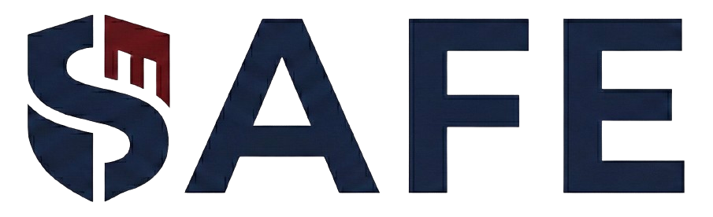
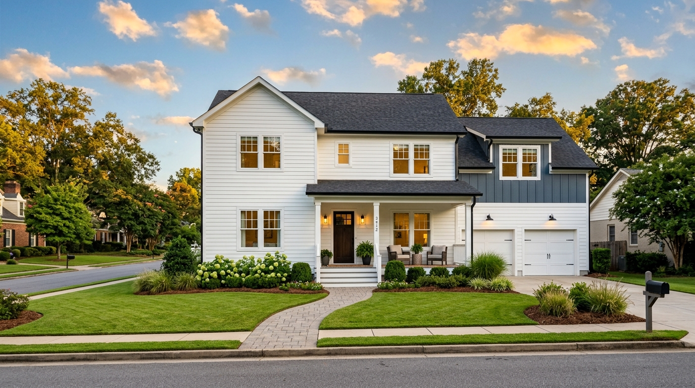

# Safe Capital — עמוד עסקאות (Properties) — קוד מובייל מלא

קובץ בנדל המיועד להעלאה ל־Claude Design. כולל את כל ה־HTML, CSS ו־JavaScript הנדרש
כדי להבין, לשחזר ולערוך את עמוד העסקאות במובייל (RTL, עברית).

---

## 1. רקע ומפרט כללי

- **עמוד:** `website/properties.html` — עמוד "העסקאות שלנו" של Safe Capital
- **שפה:** עברית (RTL), `<html dir="rtl" lang="he">`
- **קהל יעד:** משקיעים ישראליים — עסקאות Fix-and-Flip בבירמינגהם, אלבמה
- **רוחב מובייל:** `< 768px` (breakpoint מרכזי). טלפונים קטנים: `< 375px`
- **שרתים:** האתר רץ על פורט 8081, הדאטה נטענת מה־Admin API:
  - Local: `http://localhost:3000/api/public/deals`
  - Prod: `https://admin.safecapital.co.il/api/public/deals`
- **תלויות חיצוניות:** Tailwind (CDN) + forms + container-queries,
  Google Fonts (Heebo, Inter, Material Symbols Outlined).
- **מבנה הדף במובייל (מלמעלה למטה):**
  1. Top Nav — לוגו + hamburger + mobile drawer
  2. Hero ציניאמטי ("העסקאות שלנו / השבחה. מכירה. רווח.") + תמונה + meta-grid 2×2
  3. רשימת כרטיסי עסקאות (Accordion — נטען דינאמית מה־API)
  4. Footer ניווט
  5. Nagishli widget (נגישות)

---

## 2. עקרונות עיצוב וברנד

### צבעים (מקור אמת — ב־Tailwind config של הדף)

| Token | Hex | שימוש |
|-------|-----|-------|
| Background | `#fbf9f6` | רקע הדף הראשי |
| Surface | `#f5f3f0` / `surface-container-low` | בלוקים משניים |
| Surface Container | `#efeeeb` | רקע רגיל (כרטיס ברקע) |
| Surface Container High | `#eae8e5` | כרטיסים נוספים |
| Surface Container Highest | `#e4e2df` | |
| Surface Container Lowest | `#ffffff` | כרטיסים — לבן |
| Navy (Primary) | `#022445` | כותרות, CTA, מספרים |
| Navy Dark (Primary Container) | `#1e3a5c` | Gradient partner |
| Crimson (Secondary) | `#984349` | מספרי מפתח, דגשים, accent |
| Text (On Surface) | `#1b1b1f` | טקסט ראשי |
| Text Muted (On Surface Variant) | `#43474e` | טקסט גוף/משני |
| Outline Variant | `#c4c6cf` | מפרידים עדינים |
| WhatsApp | `#25D366` | כפתור CTA ירוק |

### טיפוגרפיה

- **עברית:** Heebo 300/400/700/800/900
- **אנגלית / מספרים פיננסיים:** Inter 400/500/600/700
- **אייקונים:** Material Symbols Outlined

**חוק ברזל:** כל גדלי הפונט מוגדרים אך ורק דרך CSS custom properties
(`--fs-*` ב־`tokens.css`) או מחלקות `.t-*` (ב־`typography.css`).
אסור `font-size: Xrem` hardcoded. אסור `text-xs/sm/base` של Tailwind
לגודל טקסט. מובייל קטן: fallback מהגלובלי של `shared.css`.

### אילוצי עיצוב (ברזל)

- **RTL by default** — כל layout/flex/spacing מניח RTL.
- **לא קווי גבול 1px** להפרדה — תמיד שינוי רקע.
- **Shadow מקסימלי:** `blur 24px`, `Y 8px`, opacity 4% (`rgba(27,28,26,0.04)`
  או `rgba(2,36,69,0.04)`).
- **ללא center-align בגוף הטקסט** — עברית flush-right, אנגלית flush-left.
  Center מותר רק לכותרות hero ולרכיבי progress קטנים.
- **Focus ring:** 2px bottom-border בלבד בצבע Navy — לא full-box.
- **אין pulse dot** בבאדג'ים הצפים על התמונה במובייל — רק crimson מלא עם טקסט.

---

## 3. HTML — `website/properties.html` (מלא)

```html
<!DOCTYPE html>

<html dir="rtl" lang="he"><head>
<meta charset="utf-8"/>
<link rel="icon" type="image/png" href="images/logo-icon.png"/>
<meta content="width=device-width, initial-scale=1.0" name="viewport"/>
<title>Safe Capital | עסקאות</title>
<script src="https://cdn.tailwindcss.com?plugins=forms,container-queries"></script>
<link href="https://fonts.googleapis.com/css2?family=Heebo:wght@300;400;700;800;900&family=Inter:wght@400;500;600;700&display=swap" rel="stylesheet"/>
<link href="https://fonts.googleapis.com/css2?family=Material+Symbols+Outlined:wght,FILL@100..700,0..1&display=swap" rel="stylesheet"/>
<link href="css/tokens.css?v=3" rel="stylesheet"/>
<link href="css/typography.css" rel="stylesheet"/>
<link href="css/shared.css?v=13" rel="stylesheet"/>
<link href="css/properties.css?v=6" rel="stylesheet"/>
<script id="tailwind-config">
      tailwind.config = {
        darkMode: "class",
        theme: {
          extend: {
            colors: {
              "tertiary-fixed": "#e5e2e1",
              "surface-container-highest": "#e4e2df",
              "error": "#ba1a1a",
              "on-error": "#ffffff",
              "primary-fixed-dim": "#adc8f2",
              "on-primary-fixed": "#001c39",
              "on-secondary-fixed": "#40010b",
              "secondary-fixed": "#ffdada",
              "surface-container-low": "#f5f3f0",
              "on-primary-fixed-variant": "#2d486b",
              "on-tertiary-fixed": "#1c1b1b",
              "on-secondary": "#ffffff",
              "on-primary-container": "#8aa4cc",
              "on-tertiary-fixed-variant": "#474746",
              "error-container": "#ffdad6",
              "surface-container": "#efeeeb",
              "surface-container-lowest": "#ffffff",
              "background": "#fbf9f6",
              "surface": "#fbf9f6",
              "primary-fixed": "#d3e3ff",
              "inverse-on-surface": "#f2f0ed",
              "tertiary-fixed-dim": "#c8c6c5",
              "tertiary": "#242423",
              "surface-variant": "#e4e2df",
              "surface-tint": "#456084",
              "inverse-surface": "#30312f",
              "surface-bright": "#fbf9f6",
              "outline": "#74777f",
              "on-error-container": "#93000a",
              "primary": "#022445",
              "on-tertiary": "#ffffff",
              "surface-dim": "#dbdad7",
              "secondary-fixed-dim": "#ffb3b4",
              "on-secondary-container": "#792b31",
              "on-background": "#1b1b1f",
              "on-tertiary-container": "#a4a2a2",
              "on-surface-variant": "#43474e",
              "primary-container": "#1e3a5c",
              "secondary-container": "#ff9599",
              "on-primary": "#ffffff",
              "inverse-primary": "#adc8f2",
              "on-secondary-fixed-variant": "#7a2d33",
              "tertiary-container": "#393939",
              "outline-variant": "#c4c6cf",
              "on-surface": "#1b1b1f",
              "surface-container-high": "#eae8e5",
              "secondary": "#984349",
              "whatsapp": "#25D366"
            },
            fontFamily: {
              "headline": ["Heebo", "sans-serif"],
              "body": ["Heebo", "sans-serif"],
              "label": ["Inter", "sans-serif"]
            },
            borderRadius: {"DEFAULT": "0.25rem", "lg": "0.5rem", "xl": "0.75rem", "full": "9999px"},
          },
        },
      }
    </script>
<style>
        .material-symbols-outlined {
            font-variation-settings: 'FILL' 0, 'wght' 400, 'GRAD' 0, 'opsz' 24;
        }
        .glass-header {
            background: rgba(251, 249, 246, 0.8);
            backdrop-filter: blur(20px);
        }
        .no-scrollbar::-webkit-scrollbar { display: none; }

        /* Deal summary row */
        .deal-summary-row {
            display: flex;
            flex-direction: row;
            align-items: center;
            gap: 1rem;
            width: 100%;
            direction: rtl;
        }
        .deal-summary-row .deal-num {
            font-family: 'Inter', sans-serif;
            font-weight: 700;
            font-size: var(--fs-body-lg);
            color: #022445;
            min-width: 2.5rem;
            text-align: center;
            flex-shrink: 0;
        }
        .deal-summary-row .deal-name {
            font-family: 'Inter', sans-serif;
            font-weight: 700;
            font-size: var(--fs-body);
            color: #022445;
            white-space: nowrap;
            flex-shrink: 0;
        }
        .deal-summary-row .deal-status-badge {
            display: inline-flex;
            align-items: center;
            padding: 0.25rem 0.75rem;
            border-radius: 9999px;
            font-size: var(--fs-label);
            font-weight: 600;
            white-space: nowrap;
            flex-shrink: 0;
        }
        .deal-status-badge.property-status {
            background: rgba(2, 36, 69, 0.08);
            color: #022445;
        }
        .deal-status-badge.fundraising-status {
            background: rgba(152, 67, 73, 0.1);
            color: #984349;
        }
        .deal-summary-row .deal-value {
            font-family: 'Inter', sans-serif;
            font-weight: 700;
            font-size: var(--fs-body-sm);
            color: #1b1b1f;
            white-space: nowrap;
            flex-shrink: 0;
        }
        .deal-summary-row .deal-profit {
            font-family: 'Inter', sans-serif;
            font-weight: 800;
            font-size: var(--fs-body-sm);
            color: #984349;
            white-space: nowrap;
            flex-shrink: 0;
        }
        .deal-summary-row .deal-thumb {
            width: 3.5rem;
            height: 3.5rem;
            border-radius: 0.5rem;
            object-fit: cover;
            flex-shrink: 0;
        }
        .deal-summary-row .deal-arrow-wrap {
            margin-inline-start: auto;
            flex-shrink: 0;
            display: flex;
            align-items: center;
            gap: 0.375rem;
            cursor: pointer;
            transition: opacity 0.2s;
        }
        .deal-summary-row .deal-arrow-wrap:hover { opacity: 0.8; }
        .deal-arrow-label {
            font-family: 'Heebo', sans-serif;
            font-size: var(--fs-body-xs);
            font-weight: 700;
            color: #984349;
            white-space: nowrap;
        }

        /* Mobile: card layout for deal summary */
        @media (max-width: 767px) {
            .deal-summary-row {
                flex-direction: column;
                align-items: stretch;
                gap: 0.75rem;
                padding: 1rem;
            }
            .deal-summary-row .deal-thumb { width: 3rem; height: 3rem; order: 1; }
            .deal-summary-row .deal-name { order: 2; font-size: 0.9375rem; }
            .deal-summary-row .deal-num { order: 3; font-size: 0.875rem; min-width: auto; }
            .deal-summary-row .deal-meta-fields {
                display: flex;
                flex-wrap: wrap;
                gap: 0.5rem;
                width: 100%;
                order: 10;
                justify-content: flex-start;
            }
            .deal-summary-row .deal-value,
            .deal-summary-row .deal-profit { font-size: 0.8125rem; }
            .deal-summary-row .deal-arrow-wrap {
                order: 20;
                justify-content: center;
                margin-inline-start: 0;
                width: 100%;
            }
            .deal-arrow-label { font-size: 0.75rem; }
        }
        @media (min-width: 768px) {
            .deal-summary-row .deal-meta-fields { display: contents; }
        }

        /* Tooltip styles */
        .tooltip-trigger {
            display: inline-flex;
            align-items: center;
            justify-content: center;
            width: 1.25rem;
            height: 1.25rem;
            border-radius: 50%;
            background: rgba(2, 36, 69, 0.1);
            color: #022445;
            font-size: var(--fs-label);
            font-weight: 700;
            cursor: pointer;
            position: relative;
            vertical-align: middle;
            margin-right: 0.375rem;
            border: none;
            line-height: 1;
        }
        .tooltip-popup {
            position: absolute;
            bottom: calc(100% + 0.75rem);
            right: 50%;
            transform: translateX(50%);
            background: #fff;
            color: #1b1b1f;
            padding: 0.875rem 1rem;
            border-radius: 0.5rem;
            box-shadow: 0 8px 32px rgba(0,0,0,0.15);
            font-size: var(--fs-caption);
            line-height: 1.7;
            width: 280px;
            z-index: 50;
            text-align: right;
        }
        .tooltip-popup::after {
            content: '';
            position: absolute;
            top: 100%;
            right: 50%;
            transform: translateX(50%);
            border: 6px solid transparent;
            border-top-color: #fff;
        }

        /* Cost category accordion */
        .cost-category-header {
            display: flex;
            justify-content: space-between;
            align-items: center;
            padding: 0.875rem 0;
            cursor: pointer;
            border-bottom: 1px solid rgba(196, 198, 207, 0.2);
            transition: background 0.15s;
        }
        .cost-category-header:hover { background: rgba(2, 36, 69, 0.02); }
        .cost-category-items {
            max-height: 0;
            overflow: hidden;
            transition: max-height 0.3s ease;
        }
        .cost-category-items.open { max-height: 500px; }
        .cost-category-arrow { transition: transform 0.3s ease; }
        .cost-category-arrow.open { transform: rotate(180deg); }

        /* Deal expanded panel */
        .deal-expanded {
            max-height: 0;
            overflow: hidden;
            transition: max-height 0.5s ease;
            padding: 0 1.5rem;
        }
        .deal-expanded.open {
            max-height: 9999px;
            padding: 2rem 1.5rem 3rem;
            overflow: visible;
            position: relative;
        }
        .deal-card-v2:has(.deal-expanded.open) { overflow: visible; }

        /* Expanded panel — section rhythm (desktop) */
        .deal-expanded.open > .deal-section { margin-top: 4rem; }
        .deal-expanded.open > .deal-section:first-child { margin-top: 0; }
        .deal-expanded.open > .deal-section--gallery { margin-top: 2rem; }
        .deal-expanded.open > .deal-section--specs { margin-top: 2.5rem; }
        .deal-expanded.open > .deal-section--cost-breakdown { margin-top: 5rem; }
        .deal-expanded.open > .deal-section--cta { margin-top: 5rem; }
        .deal-expanded.open > .deal-section--post-sale { margin-top: 3rem; }

        /* Sticky CTA — desktop only */
        .deal-sticky-cta {
            position: sticky;
            bottom: 1.25rem;
            z-index: 10;
            display: flex;
            align-items: center;
            justify-content: center;
            gap: 0.5rem;
            margin-top: 2rem;
            margin-inline: auto;
            width: fit-content;
            padding: 0.75rem 1.5rem;
            background: #022445;
            color: #ffffff;
            border-radius: 9999px;
            font-family: 'Heebo', sans-serif;
            font-weight: 700;
            font-size: var(--fs-body-sm);
            box-shadow: 0 8px 24px rgba(2, 36, 69, 0.18);
            text-decoration: none;
            transition: background 0.2s, transform 0.1s;
        }
        .deal-sticky-cta:hover { background: #1e3a5c; }
        .deal-sticky-cta:active { transform: translateY(1px); }
        .deal-sticky-cta:focus-visible {
            outline: 2px solid #984349;
            outline-offset: 3px;
        }
        .deal-sticky-cta .material-symbols-outlined { font-size: 1.125rem; }
        @media (max-width: 767px) { .deal-sticky-cta { display: none; } }

        /* Deal arrow rotation on open */
        .deal-arrow { transition: transform 0.3s ease; }
        .deal-arrow.open { transform: rotate(180deg); }

        /* Deal card v2 */
        .deals-list > div[data-deal-id],
        .deal-card,
        #deals-container > div,
        #deals-container article { opacity: 1 !important; }

        .deal-card-v2 { position: relative; }

        /* Badges */
        .deal-badge {
            display: inline-flex;
            align-items: center;
            gap: 0.375rem;
            padding: 0.25rem 0.75rem;
            border-radius: 9999px;
            font-family: 'Inter', sans-serif;
            font-size: var(--fs-label);
            font-weight: 700;
            white-space: nowrap;
            width: fit-content;
            line-height: 1.2;
        }
        .deal-badge--filled-crimson { background: #984349; color: #ffffff; }
        .deal-badge--outline-crimson {
            background: rgba(152, 67, 73, 0.08);
            color: #984349;
            border: 1px solid rgba(152, 67, 73, 0.3);
        }
        .deal-badge--light-navy { background: rgba(2, 36, 69, 0.08); color: #022445; }

        /* Mobile-only: unify badges floating on image → all crimson filled, text only */
        @media (max-width: 767px) {
            .deal-header .absolute .deal-badge {
                background: #984349 !important;
                color: #ffffff !important;
                border: none !important;
            }
            .deal-header .absolute .deal-badge .material-symbols-outlined,
            .deal-header .absolute .deal-badge .deal-badge__dot {
                display: none !important;
            }
            .deal-card-v2 .deal-accent-strip { display: none !important; }

            /* Vertical dividers between numbers cells — Stitch style */
            .deal-numbers-divider { position: relative; }
            .deal-numbers-divider::before {
                content: '';
                position: absolute;
                top: 15%;
                bottom: 15%;
                right: -8px;
                width: 1px;
                background: #e4e2df;
            }
        }

        /* Floating ribbon for deal number on mobile image */
        .deal-number-ribbon {
            display: inline-flex;
            align-items: center;
            padding: 0.25rem 0.75rem;
            border-radius: 9999px;
            font-family: 'Inter', sans-serif;
            font-size: var(--fs-label);
            font-weight: 700;
            background: rgba(255, 255, 255, 0.95);
            color: #022445;
            box-shadow: 0 2px 8px rgba(2, 36, 69, 0.12);
            backdrop-filter: blur(8px);
            white-space: nowrap;
            line-height: 1.2;
        }

        .deal-badge--filled-navy { background: #022445; color: #ffffff; }

        .deal-badge__dot {
            width: 0.5rem;
            height: 0.5rem;
            border-radius: 9999px;
            background: currentColor;
            animation: dealPulse 1.5s ease-in-out infinite;
        }
        @keyframes dealPulse {
            0%, 100% { opacity: 1; transform: scale(1); }
            50%      { opacity: 0.5; transform: scale(1.2); }
        }
        @media (prefers-reduced-motion: reduce) {
            .deal-badge__dot { animation: none; }
        }

        /* Accent strip (Active variant only — hidden on mobile) */
        .deal-accent-strip {
            position: absolute;
            right: 0;
            top: 0;
            width: 4px;
            height: 100%;
            background: #984349;
            pointer-events: none;
            z-index: 1;
        }

        /* Numbers — typography spec: Inter 800 */
        .deal-number {
            font-family: 'Inter', sans-serif;
            font-weight: 800;
            line-height: 1.1;
            letter-spacing: -0.01em;
        }
        @media (min-width: 768px) { .deal-number { white-space: nowrap; } }
        .deal-number--regular { font-size: var(--fs-body-xs); }  /* 14px mobile */
        .deal-number--hero    { font-size: var(--fs-body-xs); }  /* 14px mobile (uniform) */
        @media (min-width: 768px) {
            .deal-number--regular { font-size: var(--fs-metric); }    /* 24px desktop */
            .deal-number--hero    { font-size: var(--fs-metric-xl); } /* 32px desktop */
        }
        .deal-number-label {
            font-family: 'Inter', sans-serif;
            font-size: var(--fs-label);
            font-weight: 500;
            color: #43474e;
            margin-bottom: 0.25rem;
            letter-spacing: 0.02em;
        }
        .deal-number--navy         { color: #022445; }
        .deal-number--crimson      { color: #984349; }
        .deal-number--crimson-soft { color: rgba(152, 67, 73, 0.75); }
        .deal-number--navy-soft    { color: rgba(2, 36, 69, 0.65); }

        /* Title + location */
        .deal-card-title {
            font-family: 'Heebo', sans-serif;
            font-weight: 700;
            font-size: var(--fs-h4);
            line-height: 1.3;
            color: #022445;
        }
        .deal-card-subtitle {
            font-family: 'Heebo', sans-serif;
            font-size: var(--fs-label);
            color: rgba(67, 71, 78, 0.7);
            margin-top: 0.125rem;
        }

        /* CTA buttons */
        .deal-cta {
            display: inline-flex;
            align-items: center;
            gap: 0.375rem;
            font-family: 'Heebo', sans-serif;
            font-weight: 700;
            border-radius: 0.75rem;
            transition: all 0.2s;
            text-decoration: none;
            cursor: pointer;
            border: 0;
            white-space: nowrap;
        }
        .deal-cta--filled-navy {
            background: #022445;
            color: #ffffff;
            padding: 0.75rem 1.5rem;
            font-size: var(--fs-body);
        }
        .deal-cta--filled-navy:hover { background: #1e3a5c; }
        .deal-cta--surface-tonal {
            background: #eae8e5;
            color: #022445;
            padding: 0.75rem 1.5rem;
            font-size: var(--fs-body-sm);
        }
        .deal-cta--surface-tonal:hover { background: #dbdad7; }
        .deal-cta--text-only {
            background: transparent;
            color: #022445;
            padding: 0.5rem 0;
            font-size: var(--fs-body-xs);
        }
        .deal-cta--text-only:hover { color: #984349; }

        /* Progress bars */
        .deal-progress-track {
            width: 100%;
            height: 0.5rem;
            background: rgba(2, 36, 69, 0.08);
            border-radius: 9999px;
            overflow: hidden;
            margin-bottom: 0.5rem;
        }
        .deal-progress-fill--crimson {
            background: #984349;
            height: 100%;
            border-radius: 9999px;
            transition: width 0.3s;
        }
        .deal-progress-fill--navy {
            background: #022445;
            height: 100%;
            border-radius: 9999px;
            transition: width 0.3s;
        }
        .deal-progress-text {
            font-family: 'Heebo', sans-serif;
            font-size: var(--fs-caption);
            color: #43474e;
            line-height: 1.5;
        }

        .deal-numbers-row {
            display: flex;
            gap: 1.5rem;
            align-items: flex-start;
        }
        .deal-numbers-row > div { min-width: 0; }

        .deal-card-thumb {
            width: 6rem;
            height: 6rem;
            border-radius: 0.75rem;
            object-fit: cover;
            flex-shrink: 0;
        }

        /* Mobile-specific tweaks */
        @media (max-width: 767px) {
            .deal-number-label {
                font-size: var(--fs-label);
                white-space: nowrap;
                text-align: center;
                margin-bottom: 0.375rem;
            }
            .deal-numbers-mobile-grid > div { justify-content: center; }
            .deal-numbers-row > div,
            .deal-numbers-row .flex.flex-col {
                text-align: center;
                align-items: center;
            }
            .deal-progress-text { font-size: var(--fs-label); }
            .deal-cta--filled-navy,
            .deal-cta--surface-tonal {
                width: 100%;
                justify-content: center;
                padding: 0.75rem 1rem;
            }
            .deal-card-title { font-size: 1rem; }
            .deal-numbers-row { gap: 0.5rem; }
        }

        /* Mobile typography + spacing for deals */
        @media (max-width: 767px) {
            .deal-summary-row .deal-num { font-size: 0.9375rem; }
            .deal-summary-row .deal-name { font-size: 0.875rem; }
            .deal-summary-row .deal-value { font-size: 0.8125rem; }
            .deal-summary-row .deal-profit { font-size: 0.8125rem; }
            .deal-arrow-label { font-size: 0.75rem; }

            .deal-expanded { padding: 1rem !important; }
            .deal-expanded .gap-12 { gap: 1.5rem !important; }
            .deal-expanded .gap-8 { gap: 1rem !important; }
            .deal-expanded .p-8 { padding: 1rem !important; }
            .deal-expanded .p-6 { padding: 0.75rem !important; }
            .deal-expanded .pt-12 { padding-top: 1.5rem !important; }
            .deal-expanded .mt-8 { margin-top: 1rem !important; }
            .deal-expanded .mb-8 { margin-bottom: 1rem !important; }

            .deal-expanded a[class*="bg-whatsapp"] {
                font-size: 0.9375rem;
                padding: 0.625rem 1.25rem;
            }

            .deal-expanded .grid-cols-2 { gap: 0.5rem !important; }

            /* Mobile Stitch-style deal cards */
            .mobile-deal-expanded {
                max-height: 0;
                overflow: hidden;
                transition: max-height 0.5s ease;
                padding: 0 0.75rem !important;
                background: #ffffff;
                margin-left: -0.75rem;
                margin-right: -0.75rem;
            }
            .mobile-deal-expanded.open {
                max-height: 9999px;
                padding-top: 0;
                padding-bottom: 0;
            }
            .mobile-collapse-btn {
                border: none;
                background: rgba(228, 226, 223, 0.5);
            }
            .mobile-cost-arrow { transition: transform 0.3s ease; }
        }
    </style>
</head>
<body class="bg-background text-on-background font-body">

<!-- ═══════════════════════ Top Nav ═══════════════════════ -->
<nav class="site-nav">
  <div class="nav-inner">
    <a href="index.html" class="nav-logo"></a>
    <div class="nav-links">
      <a href="index.html">עמוד הבית</a>
      <a href="properties.html" class="active">עסקאות</a>
      <a href="birmingham.html">בירמינגהם</a>
      <a href="investor-nights.html">ערב משקיעים</a>
      <a href="join.html">איך מצטרפים</a>
      <a href="contact.html">צור קשר</a>
    </div>
    <button class="mobile-menu-btn"><span class="material-symbols-outlined">menu</span></button>
    <a href="join.html" class="nav-cta">הצטרפו עכשיו</a>
  </div>
  <div class="mobile-nav">
    <a href="index.html">עמוד הבית</a>
    <a href="properties.html" class="active">עסקאות</a>
    <a href="birmingham.html">בירמינגהם</a>
    <a href="investor-nights.html">ערב משקיעים</a>
    <a href="join.html">איך מצטרפים</a>
    <a href="contact.html">צור קשר</a>
    <a href="join.html" class="mobile-cta">הצטרפו עכשיו</a>
  </div>
</nav>

<!-- ═══════════════════════ Cinematic Hero ═══════════════════════ -->
<div class="props-hero">
  
  <div class="hero-overlay hero-gradient"></div>
  <div class="hero-content">
    <h1 class="props-hero-title">
      העסקאות שלנו<br>
      <span class="accent">השבחה. מכירה. רווח.</span>
    </h1>
    <p class="hero-sub">
      אנחנו יודעים לאתר נכסים ישנים בשכונות יוקרה בבירמינגהם<br>
      אנחנו שואפים לעסקאות קצרות טווח עם רווח מקסימלי בכל עסקה
    </p>
    <div class="hero-meta-row">
      <div class="hero-meta">
        <div class="k">משך עסקה</div>
        <div class="v">6&ndash;12 חודשים</div>
      </div>
      <div class="hero-meta-sep"></div>
      <div class="hero-meta">
        <div class="k">יעד תשואה</div>
        <div class="v">
          20% על ההון
          <button type="button" class="meta-tip-btn" aria-expanded="false" aria-controls="meta-tip-yield" aria-label="איך מחשבים את התשואה?">?</button>
        </div>
      </div>
      <div class="hero-meta-sep"></div>
      <div class="hero-meta">
        <div class="k">השקעה מינימלית</div>
        <div class="v">$50,000</div>
      </div>
      <div class="hero-meta-sep"></div>
      <div class="hero-meta accent">
        <div class="k">שקיפות</div>
        <div class="v">100%</div>
      </div>
    </div>
  </div>
  <div class="hero-tickruler"></div>
</div>

<!-- Tooltip modal — outside .props-hero so position:fixed works -->
<div class="meta-tip-backdrop" aria-hidden="true"></div>
<div class="meta-tip" id="meta-tip-yield" role="tooltip">
  השקעת $50,000 ← בסיום העסקה $60,000<br>
  <strong>רווח $10,000 = 20% על ההון</strong><br>
  זה לא אחוז שנתי — זה אחוז על העסקה כולה (6&ndash;12 חודשים)
</div>

<!-- ═══════════════════════ Deals List (dynamic) ═══════════════════════ -->
<main class="pt-12 md:pt-16 pb-20 max-w-7xl mx-auto px-5 md:px-12">
  <section>
    <div id="deals-container" class="space-y-10 md:space-y-4">
      <!-- Loading, empty, error, and deal cards injected by js/deals.js -->
    </div>
  </section>
</main>

<!-- ═══════════════════════ Footer ═══════════════════════ -->
<footer class="site-footer">
  <div class="footer-inner">
    <div class="footer-links"><h4>ניווט מהיר</h4>
      <a href="index.html">עמוד הבית</a><a href="properties.html">עסקאות</a><a href="join.html">איך מצטרפים</a><a href="contact.html">צור קשר</a>
    </div>
    <div class="footer-links"><h4>מידע נוסף</h4>
      <a href="privacy.html">מדיניות פרטיות</a><a href="terms.html">תקנון אתר</a><a href="#">שאלות נפוצות</a>
    </div>
    <div class="footer-brand-cta" style="align-items:flex-end;gap:1.5rem">
      <div class="footer-brand">
        <p data-setting="footer_description">חברת Safe Capital מתמחה באיתור, השבחה ומכירה של נכסי נדל"ן בארה"ב, עם דגש על שקיפות מלאה ותשואה גבוהה למשקיעים</p>
      </div>
      <div class="footer-buttons" style="margin-top:0;width:100%;max-width:320px">
        <a href="join.html" class="footer-cta-btn" style="width:100%;text-align:center">הצטרפו עכשיו</a>
        <a href="contact.html" class="footer-ghost-btn" style="width:100%;text-align:center">צור קשר</a>
      </div>
    </div>
  </div>
  <div class="footer-bottom">
    <span data-setting="copyright_text">&copy; 2026 Safe Capital. כל הזכויות שמורות</span>
    <span class="footer-bottom-contact"><span data-setting="email_info">safecapital2024@gmail.com</span> | <span data-setting="phone_footer">054-7828550</span></span>
  </div>
</footer>

<script src="js/shared.js?v=2"></script>
<script src="js/settings.js"></script>
<script src="js/deal-display-config.js?v=12"></script>
<script src="js/deals.js?v=23"></script>
<script>
// Cost category accordion toggle — called from dynamically rendered HTML
function toggleCostCategory(header) {
    const items = header.nextElementSibling;
    const arrow = header.querySelector('.cost-category-arrow');
    items.classList.toggle('open');
    arrow.classList.toggle('open');
}

// Hero meta tooltip toggle. Desktop: floating. Mobile: centered modal w/ backdrop.
function closeAllMetaTips() {
    document.querySelectorAll('.meta-tip.open').forEach(function(tip) {
        tip.classList.remove('open');
        const trigger = document.querySelector('.meta-tip-btn[aria-controls="' + tip.id + '"]');
        if (trigger) trigger.setAttribute('aria-expanded', 'false');
    });
    const bd = document.querySelector('.meta-tip-backdrop');
    if (bd) bd.classList.remove('open');
}
function positionTipForDesktop(tip, btn) {
    const r = btn.getBoundingClientRect();
    tip.style.top = (r.top - 12) + 'px';
    tip.style.left = (r.left + r.width / 2) + 'px';
    tip.style.transform = 'translate(-50%, -100%)';
}
document.addEventListener('click', function(e) {
    const btn = e.target.closest('.meta-tip-btn');
    if (btn) {
        const id = btn.getAttribute('aria-controls');
        const tip = document.getElementById(id);
        if (!tip) return;
        const willOpen = !tip.classList.contains('open');
        closeAllMetaTips();
        if (willOpen) {
            tip.style.cssText = '';
            if (window.matchMedia('(min-width: 768px)').matches) {
                positionTipForDesktop(tip, btn);
            }
            tip.classList.add('open');
            const bd = document.querySelector('.meta-tip-backdrop');
            if (bd) bd.classList.add('open');
            btn.setAttribute('aria-expanded', 'true');
        }
        e.stopPropagation();
        return;
    }
    if (e.target.closest('.meta-tip')) {
        e.stopPropagation();
        return;
    }
    closeAllMetaTips();
});
document.addEventListener('keydown', function(e) {
    if (e.key === 'Escape') closeAllMetaTips();
});
window.addEventListener('resize', closeAllMetaTips);
</script>
</body></html>
```

---

## 4. CSS — Tokens (`website/css/tokens.css`)

```css
/* Safe Capital — Typography Tokens
   מקור אמת יחיד לגדלי פונט באתר. */

:root {
  /* Desktop — default values */
  --fs-display:    3rem;      /* 48px — hero / page title */
  --fs-h1:         2.25rem;   /* 36px */
  --fs-h2:         1.875rem;  /* 30px */
  --fs-h3:         1.5rem;    /* 24px */
  --fs-h4:         1.25rem;   /* 20px — כותרת כרטיס */
  --fs-body-lg:    1.125rem;  /* 18px */
  --fs-body:       1rem;      /* 16px */
  --fs-body-sm:    0.9375rem; /* 15px */
  --fs-body-xs:    0.875rem;  /* 14px */
  --fs-caption:    0.8125rem; /* 13px */
  --fs-metric-xl:  2rem;      /* 32px — hero numbers */
  --fs-metric:     1.5rem;    /* 24px — regular numbers */
  --fs-label:      0.75rem;   /* 12px — labels */

  /* Hero — properties / cinematic */
  --fs-hero:         4.5rem;    /* 72px — hero headline desktop */
  --fs-hero-mobile:  2.125rem;  /* 34px — fits "השבחה. מכירה. רווח." on 375px */
  --fs-eyebrow:      0.8125rem; /* 13px — eyebrow / uppercase */
}
```

---

## 5. CSS — Typography classes (`website/css/typography.css`)

```css
/* Safe Capital — Typography Classes — pulls from tokens.css */

.t-display   { font-size: var(--fs-display); }
.t-h1        { font-size: var(--fs-h1); }
.t-h2        { font-size: var(--fs-h2); }
.t-h3        { font-size: var(--fs-h3); }
.t-h4        { font-size: var(--fs-h4); }
.t-body-lg   { font-size: var(--fs-body-lg); }
.t-body      { font-size: var(--fs-body); }
.t-body-sm   { font-size: var(--fs-body-sm); }
.t-body-xs   { font-size: var(--fs-body-xs); }
.t-caption   { font-size: var(--fs-caption); }
.t-metric-xl { font-size: var(--fs-metric-xl); }
.t-metric    { font-size: var(--fs-metric); }
.t-label     { font-size: var(--fs-label); }
```

---

## 6. CSS — Hero & properties page (`website/css/properties.css`)

```css
/* Safe Capital — Properties page hero (cinematic).
   Desktop: 520px + 4 inline meta cells.
   Mobile (<768px): 2x2 meta grid, ken-burns disabled. */

.props-hero {
  position: relative;
  width: 100%;
  height: 520px;
  overflow: hidden;
  background:
    linear-gradient(180deg, #0b2745 0%, #3a3044 40%, #8a4a39 75%, #c0723a 100%);
}

.props-hero-img {
  position: absolute;
  inset: 0;
  width: 100%;
  height: 100%;
  object-fit: cover;
}

.props-hero-img.kenburns {
  animation: props-ken 20s ease-in-out infinite alternate;
  transform-origin: center center;
}

@keyframes props-ken {
  from { transform: scale(1) translate(0, 0); }
  to   { transform: scale(1.08) translate(-1.5%, 1%); }
}

@media (prefers-reduced-motion: reduce) {
  .props-hero-img.kenburns { animation: none; }
}

.props-hero .hero-overlay {
  position: absolute;
  inset: 0;
  pointer-events: none;
}

.props-hero .hero-overlay.hero-gradient {
  background: linear-gradient(
    180deg,
    rgba(2,36,69,0.20) 0%,
    rgba(2,36,69,0.55) 55%,
    rgba(2,36,69,0.92) 100%
  );
}

.props-hero .hero-tick-v {
  position: absolute;
  top: 96px;
  right: 48px;
  width: 1px;
  height: 96px;
  background: rgba(255,255,255,0.30);
}
.props-hero .hero-tick-h {
  position: absolute;
  top: 96px;
  right: 48px;
  height: 1px;
  width: 96px;
  background: rgba(255,255,255,0.30);
}

.props-hero .hero-content {
  position: absolute;
  inset-inline: 0;
  bottom: 0;
  padding: 0 3rem 4rem;
  max-width: 1280px;
  margin: 0 auto;
}

.props-hero .hero-eyebrow {
  display: flex;
  align-items: center;
  gap: 0.75rem;
  color: rgba(255,255,255,0.7);
  font-family: 'Inter', sans-serif;
  font-size: var(--fs-eyebrow);
  text-transform: uppercase;
  letter-spacing: 0.16em;
  margin-bottom: 1rem;
}

.props-hero .hero-eyebrow .dot {
  width: 8px;
  height: 8px;
  border-radius: 9999px;
  background: #984349;
  flex-shrink: 0;
}

.props-hero .hero-eyebrow .sep { opacity: 0.4; }

.props-hero h1.props-hero-title {
  font-family: 'Heebo', sans-serif;
  font-weight: 900;
  color: #ffffff;
  font-size: var(--fs-hero);
  line-height: 0.95;
  letter-spacing: -0.01em;
  max-width: 48rem;
  margin: 0;
}

.props-hero h1.props-hero-title .accent {
  color: rgba(255,255,255,0.8);
  white-space: nowrap;
}

.props-hero .hero-sub {
  margin-top: 1.5rem;
  color: rgba(255,255,255,0.8);
  font-size: var(--fs-body-lg);
  max-width: 40rem;
  line-height: 1.7;
  font-weight: 300;
}

.props-hero .hero-meta-row {
  margin-top: 2rem;
  display: flex;
  align-items: center;
  gap: 2.5rem;
  color: #ffffff;
}

.props-hero .hero-meta-sep {
  width: 1px;
  height: 32px;
  background: rgba(255,255,255,0.20);
}

.props-hero .hero-meta { position: relative; }

.props-hero .hero-meta .k {
  font-family: 'Inter', sans-serif;
  font-size: var(--fs-label);
  text-transform: uppercase;
  letter-spacing: 0.14em;
  color: rgba(255,255,255,0.5);
  margin-bottom: 0.25rem;
}

.props-hero .hero-meta .v {
  font-family: 'Inter', sans-serif;
  font-weight: 700;
  font-size: var(--fs-body-lg);
  line-height: 1;
  color: #ffffff;
  display: inline-flex;
  align-items: center;
  gap: 0.5rem;
}

.props-hero .hero-meta.accent .v { color: #984349; }

/* Tooltip "?" trigger on the meta value */
.props-hero .meta-tip-btn {
  display: inline-flex;
  align-items: center;
  justify-content: center;
  width: 18px;
  height: 18px;
  border-radius: 50%;
  background: rgba(255,255,255,0.15);
  color: #ffffff;
  font-family: 'Inter', sans-serif;
  font-size: var(--fs-label);
  font-weight: 700;
  border: none;
  cursor: pointer;
  line-height: 1;
  padding: 0;
  transition: background 0.15s;
}
.props-hero .meta-tip-btn:hover,
.props-hero .meta-tip-btn[aria-expanded="true"] {
  background: rgba(255,255,255,0.30);
}

.meta-tip {
  position: fixed;
  background: #ffffff;
  color: #1b1b1f;
  padding: 1rem;
  border-radius: 0.5rem;
  box-shadow: 0 8px 24px rgba(0,0,0,0.18);
  font-family: 'Heebo', sans-serif;
  font-size: var(--fs-caption);
  line-height: 1.7;
  width: 280px;
  z-index: 100;
  text-align: right;
  display: none;
  top: 0;
  left: 0;
}

.meta-tip.open { display: block; }
.meta-tip strong { color: #984349; font-weight: 700; }

.props-hero .hero-tickruler {
  position: absolute;
  bottom: 0;
  left: 0;
  right: 0;
  height: 4px;
  opacity: 0.6;
  background-image: repeating-linear-gradient(
    90deg,
    rgba(255,255,255,0.4) 0,
    rgba(255,255,255,0.4) 1px,
    transparent 1px,
    transparent 12px
  );
}

/* ═══════════════════════ Mobile (<768px) ═══════════════════════ */
@media (max-width: 767px) {
  .props-hero { height: auto; min-height: 560px; }
  .props-hero-img.kenburns { animation: none; }
  .props-hero .hero-tick-v { top: 80px; right: 24px; height: 48px; }
  .props-hero .hero-tick-h { top: 80px; right: 24px; width: 48px; }

  .props-hero .hero-content {
    padding: 0 1.5rem 1.75rem;
    position: absolute;
    bottom: 0;
    inset-inline: 0;
    margin: 0;
  }

  .props-hero h1.props-hero-title {
    /* override shared.css global mobile h1 rule (uses !important) */
    font-size: var(--fs-hero-mobile) !important;
    line-height: 1.1 !important;
  }
  .props-hero h1.props-hero-title .accent { white-space: normal; }

  .props-hero .hero-sub {
    font-size: var(--fs-body-sm);
    max-width: 100%;
    margin-top: 1rem;
    line-height: 1.6;
  }

  .props-hero .hero-meta-row {
    margin-top: 1.5rem;
    display: grid;
    grid-template-columns: 1fr 1fr;
    gap: 1rem 1.25rem;
    align-items: start;
  }

  .props-hero .hero-meta-sep { display: none; }
  .props-hero .hero-meta .k { font-size: var(--fs-label); margin-bottom: 0.375rem; }
  .props-hero .hero-meta .v { font-size: var(--fs-body); }
  .props-hero .hero-tickruler { height: 3px; }
}

/* Tooltip backdrop — mobile only */
.meta-tip-backdrop {
  display: none;
  position: fixed;
  inset: 0;
  background: rgba(0, 0, 0, 0.4);
  backdrop-filter: blur(8px);
  -webkit-backdrop-filter: blur(8px);
  z-index: 99;
}

@media (max-width: 767px) {
  .meta-tip.open {
    top: 50% !important;
    left: 50% !important;
    transform: translate(-50%, -50%);
    width: calc(100vw - 3rem);
    max-width: 360px;
    padding: 1.25rem 1.25rem 1.5rem;
    box-shadow: 0 24px 64px rgba(0,0,0,0.4);
  }
  .meta-tip-backdrop.open { display: block; }
}
```

---

## 7. CSS — Shared styles (`website/css/shared.css`)

> מלא. כולל: nav, footer, global mobile rules, scrollbar, carousel, step-progress,
> tax accordion, confetti canvas. הכללי ל־properties במובייל הוא הבלוק שמתחיל ב־
> `@media (max-width: 767px)` תחת "Properties Page".

```css
.material-symbols-outlined {
    font-variation-settings: 'FILL' 0, 'wght' 400, 'GRAD' 0, 'opsz' 24;
}
body {
    margin: 0;
    font-family: 'Heebo', sans-serif;
    scroll-behavior: smooth;
}
.editorial-shadow { box-shadow: 0 8px 24px -4px rgba(27, 28, 26, 0.04); }
.glass-nav { backdrop-filter: blur(20px); -webkit-backdrop-filter: blur(20px); }
.signature-gradient { background: linear-gradient(135deg, #022445 0%, #1e3a5c 100%); }

/* FAQ & Accordion */
.faq-answer { max-height: 0; overflow: hidden; transition: max-height 0.3s ease, padding 0.3s ease; }
.faq-answer.open { max-height: 500px; padding-top: 1rem; }
.faq-icon.open { transform: rotate(45deg); }

/* Deal Accordion */
.deal-expanded { max-height: 0; overflow: hidden; transition: max-height 0.5s ease, padding 0.3s ease; padding: 0; }
.deal-expanded.open { max-height: 8000px; padding: 1.5rem; }
@media (min-width: 768px) { .deal-expanded.open { padding: 3rem; } }
.deal-arrow { transition: transform 0.3s ease; }
.deal-arrow.open { transform: rotate(180deg); }

/* Mobile menu */
.mobile-menu { max-height: 0; overflow: hidden; transition: max-height 0.3s ease; }
.mobile-menu.open { max-height: 500px; }

/* ═══════════════════════ Standardized Nav ═══════════════════════ */
.site-nav {
    position: fixed;
    top: 0;
    width: 100%;
    z-index: 50;
    background: rgba(251, 249, 246, 0.80);
    backdrop-filter: blur(20px);
    -webkit-backdrop-filter: blur(20px);
    box-shadow: 0 1px 3px rgba(2, 36, 69, 0.06);
}
.site-nav .nav-inner {
    display: flex;
    flex-direction: row;
    direction: ltr;
    justify-content: space-between;
    align-items: center;
    position: relative;
    width: 100%;
    padding: 0.5rem 2.5rem;
    box-sizing: border-box;
}
.site-nav .nav-logo { text-decoration: none; display: flex; align-items: center; direction: ltr; }
.site-nav .nav-logo .nav-logo-img { height: 40px; width: auto; display: block; }
.site-nav .nav-links {
    display: none;
    flex-direction: row;
    direction: rtl;
    align-items: center;
    gap: 2rem;
    position: absolute;
    left: 50%;
    transform: translateX(-50%);
}
.site-nav .mobile-menu-btn { display: block; }
@media (min-width: 768px) {
    .site-nav .nav-links { display: flex; flex-direction: row; direction: rtl; }
    .site-nav .mobile-menu-btn { display: none !important; }
}
.site-nav .nav-links a {
    font-family: 'Heebo', sans-serif;
    font-size: 0.875rem;
    font-weight: 700;
    color: #43474e;
    text-decoration: none;
    transition: color 0.2s;
    padding: 0.25rem 0;
    border-bottom: 2px solid transparent;
}
.site-nav .nav-links a:hover { color: #022445; }
.site-nav .nav-links a.active { color: #984349; border-bottom-color: #984349; font-weight: 800; }
.site-nav .nav-cta {
    background: linear-gradient(135deg, #022445 0%, #1e3a5c 100%);
    color: #fff;
    padding: 0.5rem 1.5rem;
    border-radius: 0.5rem;
    font-family: 'Heebo', sans-serif;
    font-size: 0.875rem;
    font-weight: 700;
    border: none;
    cursor: pointer;
    transition: opacity 0.2s, transform 0.15s;
    white-space: nowrap;
}
.site-nav .nav-cta:hover { opacity: 0.9; }
.site-nav .nav-cta:active { transform: scale(0.97); }
@media (max-width: 767px) {
    .site-nav .nav-cta { display: none; }
    .site-nav .nav-portal-btn { display: none; }
}

.site-nav .mobile-menu-btn {
    background: none;
    border: none;
    cursor: pointer;
    color: #022445;
    padding: 0.25rem;
    font-size: 1.5rem;
    -webkit-tap-highlight-color: transparent;
}
.site-nav .mobile-menu-btn:focus { outline: none; }
.site-nav .mobile-menu-btn:focus-visible {
    outline: 2px solid #022445;
    outline-offset: 2px;
    border-radius: 4px;
}

.site-nav .mobile-nav {
    max-height: 0;
    overflow: hidden;
    background: rgba(251, 249, 246, 0.97);
    backdrop-filter: blur(20px);
    -webkit-backdrop-filter: blur(20px);
}
.site-nav .mobile-nav.open {
    max-height: 720px;
    overflow-y: auto;
    -webkit-overflow-scrolling: touch;
}
.site-nav .mobile-nav a {
    display: block;
    padding: 0.75rem 2rem;
    text-align: right;
    font-family: 'Heebo', sans-serif;
    font-size: 0.9375rem;
    font-weight: 600;
    color: #43474e;
    text-decoration: none;
    border-bottom: 1px solid rgba(196, 198, 207, 0.2);
    transition: background 0.15s, color 0.15s;
}
.site-nav .mobile-nav a:hover { background: rgba(2, 36, 69, 0.04); color: #022445; }
.site-nav .mobile-nav a.active { color: #984349; font-weight: 700; }
.site-nav .mobile-nav .mobile-cta {
    display: flex;
    align-items: center;
    justify-content: center;
    margin: 1rem 2rem;
    text-align: center;
    background: linear-gradient(135deg, #022445 0%, #1e3a5c 100%);
    color: #fff;
    padding: 0.625rem 1.5rem;
    border-radius: 0.5rem;
    font-family: 'Heebo', sans-serif;
    font-weight: 700;
    text-decoration: none;
    border-bottom: none;
}

/* ═══════════════════════ Standardized Footer ═══════════════════════ */
.site-footer {
    background: #022445;
    color: #fff;
    padding: 4rem 2rem 0;
    font-family: 'Heebo', sans-serif;
    direction: rtl;
    position: relative;
    overflow: hidden;
}
.site-footer::before {
    content: '';
    position: absolute;
    top: 50%;
    left: 50%;
    transform: translate(-50%, -50%);
    width: 280px;
    height: 280px;
    background: url('../images/logo-icon.png') no-repeat center / contain;
    filter: brightness(0) invert(1);
    opacity: 0.04;
    pointer-events: none;
    z-index: 0;
}
.site-footer .footer-inner {
    max-width: 1280px;
    margin: 0 auto;
    display: grid;
    grid-template-columns: 1fr;
    gap: 2.5rem;
    position: relative;
    z-index: 1;
}
@media (min-width: 768px) {
    .site-footer .footer-inner { grid-template-columns: 1fr 1fr 1.5fr; gap: 3rem; }
}
.site-footer .footer-brand p {
    color: rgba(255, 255, 255, 0.7);
    font-size: 0.875rem;
    line-height: 1.75;
    max-width: 320px;
}
.site-footer h4 {
    font-size: 0.9375rem;
    font-weight: 600;
    margin-bottom: 1.25rem;
    color: rgba(255, 255, 255, 0.9);
    letter-spacing: 0.01em;
}
.site-footer .footer-links a {
    display: block;
    color: rgba(255, 255, 255, 0.65);
    font-size: 0.875rem;
    text-decoration: none;
    padding: 0.3rem 0;
    transition: color 0.2s;
}
.site-footer .footer-links a:hover { color: #fff; }
.site-footer .footer-cta-btn {
    display: block;
    width: 100%;
    background: #984349;
    color: #fff;
    padding: 0.875rem 1.5rem;
    border-radius: 0.5rem;
    font-weight: 700;
    font-size: 0.9375rem;
    text-decoration: none;
    text-align: center;
    transition: filter 0.2s, transform 0.15s;
    border: none;
    cursor: pointer;
    box-sizing: border-box;
}
.site-footer .footer-cta-btn:hover { filter: brightness(1.1); transform: scale(1.02); }
.site-footer .footer-ghost-btn {
    display: block;
    width: 100%;
    background: transparent;
    color: rgba(255, 255, 255, 0.8);
    padding: 0.875rem 1.5rem;
    border-radius: 0.5rem;
    font-weight: 600;
    font-size: 0.9375rem;
    text-decoration: none;
    text-align: center;
    border: 1px solid rgba(255, 255, 255, 0.4);
    transition: border-color 0.2s, color 0.2s;
    cursor: pointer;
    box-sizing: border-box;
}
.site-footer .footer-ghost-btn:hover { border-color: #fff; color: #fff; }
.site-footer .footer-brand-cta {
    display: flex;
    flex-direction: column;
    gap: 1.25rem;
}
.site-footer .footer-brand-cta .footer-buttons {
    display: flex;
    flex-direction: column;
    gap: 0.75rem;
    max-width: 240px;
}
.site-footer .footer-bottom {
    margin-top: 3rem;
    padding: 1.25rem 0;
    border-top: 1px solid rgba(255, 255, 255, 0.1);
    display: flex;
    flex-wrap: wrap;
    justify-content: space-between;
    align-items: center;
    gap: 1rem;
    font-size: 0.8125rem;
    color: rgba(255, 255, 255, 0.5);
    position: relative;
    z-index: 1;
}
.site-footer .footer-bottom-contact {
    font-family: 'Inter', sans-serif;
    direction: ltr;
    letter-spacing: 0.01em;
}

/* ═══════════════════════ MOBILE RESPONSIVE (<=767px) ═══════════════════════ */
@media (max-width: 767px) {
    /* Prevent horizontal overflow */
    html, body { overflow-x: clip; }

    /* Global mobile headings */
    h1 { font-size: 1.625rem !important; line-height: 1.3 !important; }
    h2 { font-size: 1.375rem !important; line-height: 1.3 !important; }
    h3 { font-size: 1.125rem !important; line-height: 1.4 !important; }
    h3.text-3xl { font-size: 1.375rem !important; line-height: 1.3 !important; }

    /* Text utility size reduction */
    section p { font-size: 0.9375rem !important; line-height: 1.625 !important; }
    .text-lg { font-size: 0.9375rem !important; }
    .text-xl { font-size: 1rem !important; }
    .text-2xl:not(h1):not(h2):not(h3) { font-size: 1.25rem !important; }
    .text-3xl:not(h1):not(h2):not(h3) { font-size: 1.375rem !important; }

    /* CTA buttons compact */
    a.inline-block[class*="font-bold"][class*="px-8"],
    a.inline-flex[class*="font-bold"][class*="px-8"],
    a.inline-block[class*="font-bold"][class*="px-10"],
    a.inline-flex[class*="font-bold"][class*="px-10"] {
        font-size: 0.9375rem !important;
        padding: 0.625rem 1.25rem !important;
    }

    /* Nav Mobile */
    .site-nav .nav-inner { padding: 0.375rem 1rem; }
    .site-nav .nav-logo .nav-logo-img { height: 24px; }
    .site-nav .mobile-menu-btn {
        min-width: 44px;
        min-height: 44px;
        padding: 0.5rem;
        display: flex;
        align-items: center;
        justify-content: center;
        margin-left: auto;
    }
    .site-nav .nav-cta { display: none !important; }
    .site-nav .mobile-nav a {
        padding: 0.875rem 1.25rem;
        min-height: 48px;
        display: flex;
        align-items: center;
    }

    /* Footer Mobile */
    .site-footer { padding: 2.5rem 1.25rem 0; }
    .site-footer::before { width: 180px; height: 180px; }
    .site-footer .footer-inner {
        gap: 1.25rem;
        text-align: center;
        display: grid;
        grid-template-columns: 1fr 1fr;
        grid-template-rows: auto auto auto;
    }
    .site-footer .footer-inner > .footer-links:first-child {
        grid-column: 2 !important;
        grid-row: 1 !important;
        text-align: right;
    }
    .site-footer .footer-inner > .footer-links:nth-child(2) {
        grid-column: 1 !important;
        grid-row: 1 !important;
        text-align: right;
    }
    .site-footer .footer-inner > .footer-brand-cta {
        grid-column: 1 / -1 !important;
        grid-row: 2 / 4 !important;
        display: contents !important;
    }
    .site-footer .footer-brand {
        grid-column: 1 / -1 !important;
        grid-row: 2 !important;
        display: flex;
        flex-direction: column;
        align-items: center;
    }
    .site-footer .footer-brand .footer-logo { display: none; }
    .site-footer .footer-brand p { max-width: 100%; }
    .site-footer .footer-buttons {
        grid-column: 1 / -1 !important;
        grid-row: 3 !important;
        max-width: 280px;
        width: 100%;
        margin: 0 auto;
    }
    .site-footer .footer-bottom {
        flex-direction: column;
        text-align: center;
        gap: 0.5rem;
        padding: 1rem 0;
    }
    .site-footer .footer-cta-btn,
    .site-footer .footer-ghost-btn {
        font-size: 0.875rem !important;
        padding: 0.625rem 1.25rem !important;
    }

    /* ───────── Properties Page — Mobile ───────── */
    .deal-header .grid { gap: 1rem; }
    .deal-expanded { padding: 0 !important; }
    .deal-expanded.open { padding: 1rem !important; }
    .deal-expanded .grid { gap: 1rem; }
    .deal-expanded .space-y-16 { gap: 2rem; }
    .deal-expanded .text-2xl { font-size: 1.25rem !important; }
    .deal-expanded .text-3xl { font-size: 1.5rem !important; }
    .deal-expanded .flex.justify-between.items-start {
        overflow-x: auto;
        gap: 0.5rem;
        padding-bottom: 0.5rem;
    }
    .mt-24.bg-primary.rounded-2xl {
        margin-top: 3rem;
        padding: 2rem 1.25rem !important;
    }

    /* General touch-friendly targets */
    input, select, textarea {
        min-height: 48px;
        font-size: 16px !important; /* Prevents iOS zoom on focus */
    }

    /* Typography readability */
    .deal-expanded .text-xs,
    .deal-status-badge { font-size: 0.8125rem !important; }

    /* Full-width CTAs */
    main a.inline-block[href*="whatsapp"],
    main a.w-fit {
        width: 100%;
        text-align: center;
        box-sizing: border-box;
    }

    /* Cost category touch target */
    .cost-category-header { padding: 1rem 0 !important; }
}

/* Small phones (<=374px) */
@media (max-width: 374px) {
    h1 { font-size: 1.5rem !important; line-height: 1.3 !important; }
    h2 { font-size: 1.25rem !important; line-height: 1.3 !important; }
}

/* Scrollbar */
::-webkit-scrollbar { width: 6px; }
::-webkit-scrollbar-track { background: #f5f3f0; }
::-webkit-scrollbar-thumb { background: #c4c6cf; border-radius: 3px; }
```

---

## 8. JS — Deal display config (`website/js/deal-display-config.js`)

```javascript
/**
 * Maps deal DB fields into 3 display variants: active / renovation / sold.
 * Color rule (position-based, RTL):
 *   position 1 (right): navy
 *   position 2 (center): crimson
 *   position 3 (left):  navy
 *   progress bar/timeline: crimson
 */

function getDisplayStatus(deal) {
  if (deal.property_status === 'sold') return 'sold';
  if (deal.fundraising_status === 'completed' || deal.fundraising_status === 'closed' || deal.property_status === 'renovation') return 'renovation';
  return 'active';
}

function formatMoney(n) {
  return '$' + Math.round(Number(n) || 0).toLocaleString('en-US');
}

function minInvestmentOf(deal) {
  return deal.min_investment || 50000;
}

function roiOrDash(val, decimals) {
  if (val == null || val === '') return '—';
  return (decimals ? Number(val).toFixed(decimals) : Math.round(Number(val))) + '%';
}

// Format months: "8 חודשים" → "8<sup>חוד׳</sup>"
function monthsShort(textOrNumber) {
  const match = String(textOrNumber == null ? '' : textOrNumber).match(/\d+/);
  if (!match) return '—';
  return `${match[0]}<span style="font-size:0.6875em;font-weight:500;opacity:0.7;margin-right:0.2em;letter-spacing:0">חוד׳</span>`;
}

function monthsToCompletion(deal) {
  const match = String(deal.project_duration || '').match(/\d+/);
  if (!match) return null;
  const total = parseInt(match[0], 10);
  if (!deal.opens_at_date) return total;
  const elapsed = Math.floor((Date.now() - new Date(deal.opens_at_date).getTime()) / (1000 * 60 * 60 * 24 * 30));
  return Math.max(0, total - elapsed);
}

const DEAL_DISPLAY_CONFIG = {
  active: {
    badge: { style: 'filled-crimson', dotPulse: true, text: () => 'פתוחה להשקעה' },
    numbers: [
      { label: 'השקעה מינ׳',    value: d => formatMoney(minInvestmentOf(d)), color: 'navy' },
      { label: 'תשואה צפויה',   value: d => roiOrDash(d.expected_roi_percent), color: 'crimson' },
      { label: 'תקופה משוערת',  value: d => monthsShort(d.project_duration), color: 'navy' }
    ],
    progress: {
      type: 'fundraising',
      percent: d => d.fundraising_percent || 0,
      remaining: d => formatMoney(Math.max(0, (d.fundraising_goal || 0) - (d.fundraising_raised || 0))) + ' נותר לגייס',
      bottom: d => `${d.investor_count || 0} משקיעים בעסקה`
    },
    cta: { text: 'עוד פרטים על עסקה זו', style: 'filled-navy', expandedText: 'צמצם עסקה' },
    accentStrip: true
  },
  renovation: {
    badge: { style: 'light-navy', check: true, text: () => 'בתהליך שיפוץ' },
    numbers: [
      { label: 'סכום שגויס',    value: d => formatMoney(d.fundraising_raised || d.fundraising_goal || 0), color: 'navy' },
      { label: 'תשואה צפויה',   value: d => roiOrDash(d.expected_roi_percent), color: 'crimson' },
      { label: 'לסיום',          value: d => { const m = monthsToCompletion(d); return m != null ? monthsShort(m) : '—'; }, color: 'navy' }
    ],
    progress: {
      type: 'timeline',
      bottom: d => `${d.investor_count || 0} משקיעים בעסקה`
    },
    cta: { text: 'עוד פרטים על עסקה זו', style: 'filled-navy', expandedText: 'צמצם עסקה' },
    accentStrip: false
  },
  sold: {
    badge: { style: 'filled-navy', doubleCheck: true, text: () => 'נמכרה בהצלחה' },
    numbers: [
      { label: 'רווח שחולק',   value: d => (d.profit_distributed != null ? formatMoney(d.profit_distributed) : '—'), color: 'navy' },
      { label: 'תשואה למשקיע', value: d => roiOrDash(d.actual_roi_percent, 1), color: 'crimson' },
      { label: 'תקופת זמן',    value: d => monthsShort(d.actual_duration_months || d.project_duration), color: 'navy' }
    ],
    progress: {
      type: 'investors-enjoyed',
      bottom: d => `${d.investor_count || 0} משקיעים נהנו מהעסקה הזו`
    },
    cta: { text: 'עוד פרטים על עסקה זו', style: 'filled-navy', expandedText: 'צמצם עסקה' },
    accentStrip: false
  }
};

// Maps each property_status → ordered list of section ids to render in the
// expanded deal panel. Same config drives desktop and mobile.
const EXPANDED_PANEL_CONFIG = {
  sourcing:   ['description','unified-gallery','key-metrics','specs','comps','cost-breakdown','whatsapp-cta'],
  purchased:  ['description','unified-gallery','key-metrics','specs','comps','cost-breakdown','whatsapp-cta'],
  planning:   ['description','unified-gallery','key-metrics','specs','comps','cost-breakdown','whatsapp-cta'],
  renovation: ['description','unified-gallery','key-metrics','specs','comps','cost-breakdown','whatsapp-cta'],
  selling:    ['description','unified-gallery','key-metrics','specs','comps','cost-breakdown','whatsapp-cta'],
  sold:       ['description','unified-gallery','plan-vs-actual','specs','comps','post-sale-summary','whatsapp-cta']
};

window.getDisplayStatus = getDisplayStatus;
window.DEAL_DISPLAY_CONFIG = DEAL_DISPLAY_CONFIG;
window.EXPANDED_PANEL_CONFIG = EXPANDED_PANEL_CONFIG;
window.formatMoney = formatMoney;
```

---

## 9. JS — Deal renderer (`website/js/deals.js`) — Mobile-focused

> הקובץ המלא מחזיק גם desktop. כאן מובאות כל הפונקציות שמתקבלות במובייל
> (isMobile → מחזיר true), פלוס helpers משותפים. פוטר את הפונקציונליות של
> API + accordion + gallery + cost toggle + tooltip. זהו הקוד המלא שרץ.

```javascript
/**
 * deals.js — Safe Capital website
 * Fetches published deals from the admin API and renders them into #deals-container.
 * RTL: All rendered HTML is inside dir="rtl" root.
 */

const ADMIN_HOST = (window.location.hostname === 'localhost') ? 'http://localhost:3000' : 'https://admin.safecapital.co.il';
const API_URL = ADMIN_HOST + '/api/public/deals';

function isMobile() { return window.innerWidth < 768; }

const WHATSAPP_SVG = '<svg class="w-5 h-5" fill="currentColor" viewBox="0 0 24 24"><path d="M17.472 14.382c-.297-.149-1.758-.867-2.03-.967-.273-.099-.471-.148-.67.15-.197.297-.767.966-.94 1.164-.173.199-.347.223-.644.075-.297-.15-1.255-.463-2.39-1.475-.883-.788-1.48-1.761-1.653-2.059-.173-.297-.018-.458.13-.606.134-.133.298-.347.446-.52.149-.174.198-.298.298-.497.099-.198.05-.371-.025-.52-.075-.149-.669-1.612-.916-2.207-.242-.579-.487-.5-.669-.51-.173-.008-.371-.01-.57-.01-.198 0-.52.074-.792.372-.272.297-1.04 1.016-1.04 2.479 0 1.462 1.065 2.875 1.213 3.074.149.198 2.096 3.2 5.077 4.487.709.306 1.262.489 1.694.625.712.227 1.36.195 1.871.118.571-.085 1.758-.719 2.006-1.413.248-.694.248-1.289.173-1.413-.074-.124-.272-.198-.57-.347m-5.421 7.403h-.004a9.87 9.87 0 01-5.031-1.378l-.361-.214-3.741.982.998-3.648-.235-.374a9.86 9.86 0 01-1.51-5.26c.001-5.45 4.436-9.884 9.888-9.884 2.64 0 5.122 1.03 6.988 2.898a9.825 9.825 0 012.893 6.994c-.003 5.45-4.437 9.884-9.885 9.884m8.413-18.297A11.815 11.815 0 0012.05 0C5.495 0 .16 5.335.157 11.892c0 2.096.547 4.142 1.588 5.945L.057 24l6.305-1.654a11.882 11.882 0 005.683 1.448h.005c6.554 0 11.89-5.335 11.893-11.893a11.821 11.821 0 00-3.48-8.413z"/></svg>';

// ── Status label maps ────────────────────────────────────────────

const PROPERTY_STATUS_LABELS = {
  sourcing: 'בשלב איתור',  purchased: 'הנכס נקנה',   planning: 'בתכנון',
  renovation: 'בשיפוץ',   selling: 'מוצע למכירה',   sold: 'נמכר'
};
const FUNDRAISING_STATUS_LABELS = {
  upcoming: 'גיוס קרוב',   active: 'גיוס בעיצומו',
  completed: 'גיוס הושלם', closed: 'גיוס סגור'
};

const TIMELINE_STEP_STYLE = {
  completed: { icon: 'check',       bg: 'bg-primary',         text: 'text-white', extra: '' },
  active:    { icon: 'engineering', bg: 'bg-secondary',       text: 'text-white', extra: '' },
  pending:   { icon: '',            bg: 'bg-outline-variant', text: 'text-white', extra: 'opacity-30' }
};

function formatUSD(value) {
  if (value == null || value === '') return '—';
  const n = parseFloat(value);
  if (isNaN(n)) return '—';
  return '$' + Math.round(n).toLocaleString('en-US');
}

// ── Timeline stages (synced with admin) ──────────────────────────

const TIMELINE_STAGES = [
  { label: 'גיוס',   status: 'fundraising' },
  { label: 'רכישה',  status: 'purchased' },
  { label: 'שיפוץ',  status: 'renovation' },
  { label: 'מכירה',  status: 'selling' },
  { label: 'נמכר',   status: 'sold' }
];

function getActiveStageIndex(propertyStatus) {
  if (propertyStatus === 'sourcing') return 0;
  if (propertyStatus === 'planning') return 1;
  const idx = TIMELINE_STAGES.findIndex(s => s.status === propertyStatus);
  return idx === -1 ? 0 : idx;
}

function buildStageList(propertyStatus) {
  const activeIdx = getActiveStageIndex(propertyStatus);
  return TIMELINE_STAGES.map((stage, i) => ({
    step_name: stage.label,
    status: i < activeIdx ? 'completed' : i === activeIdx ? 'active' : 'pending'
  }));
}

// ── Mobile timeline ──────────────────────────────────────────────

function renderMobileTimeline(propertyStatus) {
  const steps = buildStageList(propertyStatus);
  const activeIndex = getActiveStageIndex(propertyStatus);
  const progressPct = steps.length > 1 ? Math.round((activeIndex / (steps.length - 1)) * 100) : 0;

  const stepsHtml = steps.map(step => {
    if (step.status === 'completed') {
      return `<div class="relative z-10 flex flex-col items-center gap-2">
        <div class="w-6 h-6 rounded-full bg-[#022445] text-white flex items-center justify-center">
          <span class="material-symbols-outlined" style="font-size:14px">check</span>
        </div>
        <span class="text-[10px] font-bold">${step.step_name}</span>
      </div>`;
    } else if (step.status === 'active') {
      return `<div class="relative z-10 flex flex-col items-center gap-2">
        <div class="w-6 h-6 rounded-full bg-[#022445] border-4 border-white shadow-sm flex items-center justify-center"></div>
        <span class="text-[10px] font-bold text-[#022445]">${step.step_name}</span>
      </div>`;
    } else {
      return `<div class="relative z-10 flex flex-col items-center gap-2">
        <div class="w-6 h-6 rounded-full bg-[#e4e2df] flex items-center justify-center"></div>
        <span class="text-[10px] font-bold text-[#43474e]">${step.step_name}</span>
      </div>`;
    }
  }).join('');

  return `<div class="px-5 py-6">
    <div class="flex items-center justify-between relative">
      <div class="absolute top-3 left-0 right-0 h-0.5 bg-[#e4e2df] z-0"></div>
      <div class="absolute top-3 right-0 h-0.5 bg-[#022445] z-0" style="width:${progressPct}%"></div>
      ${stepsHtml}
    </div>
  </div>`;
}

// ── Mobile fundraising bar ───────────────────────────────────────

function renderMobileFundraisingBar(deal) {
  const goal = parseFloat(deal.fundraising_goal || 0);
  const pct = deal.fundraising_percent || 0;
  if (goal === 0) return '';

  return `<div class="px-5 pb-6">
    <div class="flex justify-between items-center mb-2">
      <span class="text-xs font-bold text-[#022445]">התקדמות גיוס</span>
      <span class="text-xs font-bold font-label text-[#022445]">${pct}%</span>
    </div>
    <div class="h-2 w-full bg-[#e4e2df] rounded-full overflow-hidden">
      <div class="h-full bg-gradient-to-l from-[#022445] to-[#1e3a5c] rounded-full" style="width:${Math.min(pct, 100)}%"></div>
    </div>
  </div>`;
}

// ── Mobile gallery (before/after + thumb grid) ───────────────────

function renderMobileGallery(images) {
  if (!images || images.length === 0) return '';

  const beforeImages = images.filter(img => img.category === 'before');
  const afterImages = images.filter(img => img.category === 'after');
  const renderingImages = images.filter(img => img.category === 'rendering');
  const allImages = [...beforeImages, ...afterImages, ...renderingImages];

  let html = '<div class="px-5 mb-6">';

  // Before/After main image
  if (beforeImages.length > 0 || afterImages.length > 0) {
    const beforeSrc = beforeImages[0]?.image_url || '';
    const afterSrc = afterImages[0]?.image_url || '';
    html += `<div class="relative h-48 w-full rounded-lg overflow-hidden mb-2">`;
    if (afterSrc) {
      html += ``;
    } else if (beforeSrc) {
      html += ``;
    }
    html += `<div class="absolute inset-0 flex">`;
    if (beforeSrc) {
      html += `<div class="flex-1 border-l border-white/50 flex items-center justify-center">
        <span class="bg-black/40 text-white text-[10px] px-2 py-1 rounded-sm backdrop-blur-md">לפני</span>
      </div>`;
    }
    if (afterSrc) {
      html += `<div class="flex-1 flex items-center justify-center">
        <span class="bg-black/40 text-white text-[10px] px-2 py-1 rounded-sm backdrop-blur-md">אחרי</span>
      </div>`;
    }
    html += `</div></div>`;
  }

  // Thumbnail grid (4 cols)
  if (allImages.length > 1) {
    const thumbs = allImages.slice(1, 4);
    const remaining = allImages.length - 4;
    html += '<div class="grid grid-cols-4 gap-2">';
    thumbs.forEach(img => {
      html += ``;
    });
    if (remaining > 0 && allImages[4]) {
      html += `<div class="relative h-16 w-full rounded-md overflow-hidden">
        
        <div class="absolute inset-0 bg-[#022445]/60 flex items-center justify-center text-white text-xs font-bold">+${remaining}</div>
      </div>`;
    } else if (allImages[4]) {
      html += ``;
    }
    html += '</div>';
  }

  html += '</div>';
  return html;
}

// ── Mobile metrics ───────────────────────────────────────────────

function renderMobileMetrics(deal) {
  const totalCost         = deal.total_cost;
  const fundraisingGoal   = deal.fundraising_goal;
  const expectedSalePrice = deal.expected_sale_price;

  let html = '<div class="px-5 mb-6"><div class="grid grid-cols-1 gap-3">';

  if (totalCost) {
    html += `<div class="bg-[#f5f3f0] p-4 rounded-lg flex justify-between items-center">
      <p class="text-xs text-[#43474e] font-bold">עלות פרויקט כוללת</p>
      <p class="text-lg font-bold font-label text-[#022445]">${formatUSD(totalCost)}</p>
    </div>`;
  }
  if (fundraisingGoal) {
    html += `<div class="bg-[#f5f3f0] p-4 rounded-lg flex justify-between items-center">
      <p class="text-xs text-[#43474e] font-bold">סכום לגיוס</p>
      <p class="text-lg font-bold font-label text-[#022445]">${formatUSD(fundraisingGoal)}</p>
    </div>`;
  }
  if (expectedSalePrice) {
    html += `<div class="bg-[#f5f3f0] p-4 rounded-lg flex justify-between items-center">
      <p class="text-xs text-[#43474e] font-bold">מחיר מכירה צפוי</p>
      <p class="text-lg font-bold font-label text-[#984349]">${formatUSD(expectedSalePrice)}</p>
    </div>`;
  }

  html += '</div></div>';
  return html;
}

// ── Mobile specs table ───────────────────────────────────────────

function renderMobileSpecs(specs) {
  if (!specs || specs.length === 0) return '';

  const rowsHtml = specs.map(spec => `
    <tr>
      <td class="py-3 px-3">${spec.spec_name}</td>
      <td class="py-3 px-2 text-center font-label">${spec.value_before || '—'}</td>
      <td class="py-3 px-2 text-center font-label font-bold text-[#984349]">${spec.value_after || '—'}</td>
    </tr>`).join('');

  return `<div class="mb-6" style="margin-left:-0.75rem;margin-right:-0.75rem">
    <div class="bg-[#f5f3f0] overflow-hidden">
      <table class="w-full text-sm" style="table-layout:fixed">
        <thead class="bg-[#eae8e5]">
          <tr>
            <th class="py-2 px-3 text-right font-bold" style="width:50%">מפרט</th>
            <th class="py-2 px-2 text-center font-bold" style="width:25%">לפני</th>
            <th class="py-2 px-2 text-center font-bold text-[#984349]" style="width:25%">אחרי</th>
          </tr>
        </thead>
        <tbody class="divide-y divide-[#eae8e5]">${rowsHtml}</tbody>
      </table>
    </div>
  </div>`;
}

// ── Mobile cost accordion ────────────────────────────────────────

function renderMobileCostAccordion(categories) {
  if (!categories || categories.length === 0) return '';

  const filteredCats = (categories || [])
    .map(cat => {
      const items = (cat.items || []).filter(i => parseFloat(i.planned_amount || 0) > 0);
      return { ...cat, items };
    })
    .filter(cat => cat.items.length > 0 && parseFloat(cat.total_planned || 0) > 0);

  if (filteredCats.length === 0) return '';

  const items = filteredCats.map(cat => `
    <div class="bg-[#f5f3f0] p-3 rounded-lg">
      <div class="flex justify-between items-center cursor-pointer cost-category-header-mobile" onclick="toggleMobileCostCategory(this)">
        <span class="text-sm font-bold">${cat.name}</span>
        <div class="flex items-center gap-2">
          <span class="font-label font-bold text-[#022445] text-sm">${formatUSD(cat.total_planned)}</span>
          <span class="material-symbols-outlined text-[#022445] mobile-cost-arrow">expand_more</span>
        </div>
      </div>
      <div class="mobile-cost-items" style="max-height:0;overflow:hidden;transition:max-height 0.3s ease">
        ${cat.items.map(item => `
          <div class="flex justify-between py-2 border-t border-[#eae8e5] text-sm">
            <span class="text-[#43474e]">${item.name}</span>
            <span class="font-label font-medium">${formatUSD(item.planned_amount)}</span>
          </div>`).join('')}
      </div>
    </div>`).join('');

  return `
    <div class="px-5 mb-6">
      <h3 class="text-md font-bold text-[#022445] mb-3">פירוט עלויות</h3>
      <div class="space-y-2">${items}</div>
    </div>`;
}

// ── Mobile WhatsApp CTA block ────────────────────────────────────

function renderMobileWhatsAppCTA() {
  return `<div class="px-5 pb-8">
    <div class="bg-gradient-to-br from-[#022445] to-[#1e3a5c] p-6 rounded-xl text-center text-white relative overflow-hidden">
      <div class="absolute top-0 right-0 w-32 h-32 bg-white/5 rounded-full -mr-16 -mt-16 blur-2xl"></div>
      <h4 class="text-lg font-bold mb-2">מעוניין בפרטים נוספים?</h4>
      <p class="text-xs text-white/70 mb-4">הצטרף לקבוצת המשקיעים השקטה שלנו וקבל עדכונים לפני כולם</p>
      <a href="https://chat.whatsapp.com/" data-setting-href="whatsapp_group" target="_blank" rel="noopener noreferrer"
         class="w-full bg-[#25D366] hover:bg-[#128C7E] transition-colors py-3 rounded-lg flex items-center justify-center gap-2 font-bold shadow-lg text-white no-underline">
        ${WHATSAPP_SVG}
        דבר איתנו בוואטסאפ
      </a>
    </div>
  </div>`;
}

// ── Mobile description / renovation progress / plan-vs-actual / post-sale / comps / gallery sections ──

function renderMobileDescription(deal) {
  if (!deal.description) return '';
  return `
    <div class="px-5 mb-6">
      <h3 class="text-md font-bold text-[#022445] mb-2">תכנית העסקה</h3>
      <p class="text-sm text-[#43474e] leading-relaxed">${deal.description}</p>
    </div>`;
}

function renderMobileRenovationProgress(deal) {
  let pct = deal.renovation_progress_percent;
  if (pct == null) pct = 0;
  const clamped = Math.min(Math.max(Number(pct) || 0, 0), 100);
  return `
    <div class="px-5 mb-6">
      <div class="bg-gradient-to-br from-[#022445] to-[#1e3a5c] rounded-xl p-5 text-white">
        <div class="flex items-baseline justify-between mb-3">
          <h3 class="text-base font-extrabold">התקדמות השיפוץ</h3>
          <span class="font-label font-extrabold text-3xl">${clamped}%</span>
        </div>
        <div class="w-full h-2.5 bg-white/15 rounded-full overflow-hidden">
          <div class="h-full bg-[#984349] rounded-full" style="width:${clamped}%"></div>
        </div>
        ${deal.project_duration ? `<p class="mt-3 text-xs text-white/80">משך מתוכנן: ${deal.project_duration}</p>` : ''}
      </div>
    </div>`;
}

function renderMobilePlanVsActual(deal) {
  const fmtMoney = (n) => (n == null || n === '') ? '—' : formatUSD(n);
  const fmtPct = (n) => (n == null || n === '') ? '—' : Number(n).toFixed(1) + '%';

  const rows = [
    { label: 'עלות כוללת',  planned: fmtMoney(deal.total_cost),           actual: fmtMoney(deal.total_actual_cost) },
    { label: 'משך',          planned: deal.project_duration || '—',         actual: deal.actual_duration_months ? deal.actual_duration_months + ' חוד׳' : '—' },
    { label: 'מחיר מכירה',   planned: fmtMoney(deal.expected_sale_price),   actual: fmtMoney(deal.actual_sale_price) },
    { label: 'תשואה',        planned: fmtPct(deal.expected_roi_percent),    actual: fmtPct(deal.actual_roi_percent) }
  ];

  const rowsHtml = rows.map(r => `
    <tr>
      <td class="py-3 px-3 font-bold">${r.label}</td>
      <td class="py-3 px-2 text-center text-[#43474e] text-xs">${r.planned}</td>
      <td class="py-3 px-2 text-center font-bold font-label text-[#984349]">${r.actual}</td>
    </tr>`).join('');

  return `
    <div class="mb-6" style="margin-left:-0.75rem;margin-right:-0.75rem">
      <h3 class="text-base font-extrabold text-[#022445] mb-2 px-3">תוכנית מול מציאות</h3>
      <div class="bg-[#f5f3f0] overflow-hidden">
        <table class="w-full text-sm" style="table-layout:fixed">
          <thead class="bg-[#eae8e5]">
            <tr>
              <th class="py-2 px-3 text-right font-bold" style="width:40%">פרמטר</th>
              <th class="py-2 px-2 text-center font-bold text-xs" style="width:30%">מתוכנן</th>
              <th class="py-2 px-2 text-center font-bold text-[#984349]" style="width:30%">בפועל</th>
            </tr>
          </thead>
          <tbody class="divide-y divide-[#eae8e5]">${rowsHtml}</tbody>
        </table>
      </div>
    </div>`;
}

function renderMobilePostSaleSummary(deal) {
  if (!deal.sale_completion_note) return '';
  return `
    <div class="px-5 mb-6">
      <div class="bg-[#f5f3f0] p-4 rounded-lg">
        <h3 class="text-md font-bold text-[#022445] mb-2">סיכום העסקה</h3>
        <p class="text-sm text-[#43474e] leading-relaxed">${deal.sale_completion_note}</p>
      </div>
    </div>`;
}

function renderMobileComps(deal) {
  const comps = Array.isArray(deal.comps) ? deal.comps : [];
  const specs = Array.isArray(deal.specs) ? deal.specs : [];
  const findSpec = (patterns) => {
    for (const s of specs) {
      const name = String(s.spec_name || '').toLowerCase();
      if (patterns.some(p => name.includes(p))) return s.value_after || s.value_before || null;
    }
    return null;
  };
  const ourSqft     = findSpec(['sqft', 'שטח', 'גודל', 'square']);
  const ourBedrooms = findSpec(['bedroom', 'חדר']);
  const ourPrice    = deal.arv;
  const fmtSqft = (v) => (v == null || v === '') ? '—' : (typeof v === 'number' ? v.toLocaleString('en-US') : v);
  const fmtBeds = (v) => (v == null || v === '') ? '—' : v;
  const fmtDOM  = (v) => (v == null || v === '') ? '—' : v + ' ימים';

  const ourRow = `
    <tr class="bg-[#eae8e5]">
      <td class="py-2 px-2 font-bold text-[#022445] text-xs">
        <span class="bg-[#022445] text-white px-1.5 py-0.5 rounded text-[10px]">הנכס שלנו</span>
      </td>
      <td class="py-2 px-1 text-left font-label font-bold text-[#022445] text-xs">${fmtSqft(ourSqft)}</td>
      <td class="py-2 px-1 text-left font-label font-bold text-[#022445] text-xs">${fmtBeds(ourBedrooms)}</td>
      <td class="py-2 px-1 text-left font-label font-bold text-[#984349] text-xs">${formatUSD(ourPrice)}</td>
      <td class="py-2 px-1 text-left font-label text-[#43474e] text-xs">—</td>
    </tr>`;

  const compsRows = comps.map(c => {
    const addr = c.address ? String(c.address).split(',')[0] : '—';
    return `
    <tr>
      <td class="py-2 px-2 text-[#43474e] text-xs truncate" style="max-width:90px">${addr}</td>
      <td class="py-2 px-1 text-left font-label text-xs">${fmtSqft(c.sqft)}</td>
      <td class="py-2 px-1 text-left font-label text-xs">${fmtBeds(c.bedrooms)}</td>
      <td class="py-2 px-1 text-left font-label font-bold text-[#022445] text-xs">${formatUSD(c.sale_price)}</td>
      <td class="py-2 px-1 text-left font-label text-[#43474e] text-xs">${fmtDOM(c.days_on_market)}</td>
    </tr>`;
  }).join('');

  const emptyNote = comps.length === 0
    ? `<p class="text-xs text-[#43474e] mt-2 px-3">עדיין לא נאספו נכסים דומים.</p>` : '';

  return `
    <div class="mb-6" style="margin-left:-0.75rem;margin-right:-0.75rem">
      <h3 class="text-base font-extrabold text-[#022445] mb-2 px-3">השוואת נכסים בשכונה</h3>
      <div class="bg-[#f5f3f0] overflow-x-auto">
        <table class="w-full text-sm" style="table-layout:auto">
          <thead class="bg-[#eae8e5]">
            <tr>
              <th class="py-2 px-2 text-right font-bold text-[10px]">כתובת</th>
              <th class="py-2 px-1 text-left font-bold text-[10px]">sqft</th>
              <th class="py-2 px-1 text-left font-bold text-[10px]">חדרים</th>
              <th class="py-2 px-1 text-left font-bold text-[10px]">מחיר</th>
              <th class="py-2 px-1 text-left font-bold text-[10px]">זמן</th>
            </tr>
          </thead>
          <tbody class="divide-y divide-[#eae8e5]">${ourRow}${compsRows}</tbody>
        </table>
      </div>
      ${emptyNote}
    </div>`;
}

// ── Mobile unified gallery (category tabs + carousel) ────────────

const GALLERY_CATEGORY_ORDER = ['before', 'after', 'during', 'rendering'];
const GALLERY_CATEGORY_LABELS = {
  before: 'לפני', after: 'אחרי',
  during: 'במהלך השיפוץ', rendering: 'הדמיות'
};

function buildGalleryImagesMap(deal) {
  const map = {};
  const imgs = Array.isArray(deal.images) ? deal.images : [];
  for (const cat of GALLERY_CATEGORY_ORDER) {
    const list = imgs
      .filter(i => i.category === cat)
      .map(i => ({ image_url: ADMIN_HOST + i.image_url, alt_text: i.alt_text || '' }));
    if (list.length > 0) map[cat] = list;
  }
  return map;
}

function renderMobileUnifiedGallery(deal) {
  const imagesMap = buildGalleryImagesMap(deal);
  const activeCategories = Object.keys(imagesMap);
  if (activeCategories.length === 0) return '';

  const initialCategory = activeCategories[0];
  const initialList = imagesMap[initialCategory];
  const firstImg = initialList[0];
  const jsonAttr = JSON.stringify(imagesMap).replace(/'/g, '&#39;');
  const showTabs = activeCategories.length > 1;
  const showNav = initialList.length > 1;

  const tabsHtml = showTabs ? `
    <div class="flex gap-2 mt-3 overflow-x-auto" style="scrollbar-width:none">
      ${activeCategories.map(cat => {
        const isActive = cat === initialCategory;
        const activeClasses = 'bg-primary text-white';
        const idleClasses = 'bg-surface-container-low text-on-surface-variant';
        return `
          <button type="button" data-gallery-tab="${cat}" data-active="${isActive}"
                  onclick="switchGalleryCategory(event, '${deal.id}', '${cat}')"
                  class="whitespace-nowrap px-4 py-1.5 rounded-full text-xs font-bold transition ${isActive ? activeClasses : idleClasses}">
            ${GALLERY_CATEGORY_LABELS[cat] || cat}
          </button>`;
      }).join('')}
    </div>` : '';

  return `
    <div class="px-5 mb-6">
      <h3 class="text-md font-bold text-[#022445] mb-3">גלריה</h3>
      <div class="unified-gallery-wrapper"
           data-gallery-deal-id="${deal.id}"
           data-active-category="${initialCategory}"
           data-active-index="0"
           data-gallery-images='${jsonAttr}'>
        <div class="relative aspect-video rounded-xl overflow-hidden bg-surface-container-low">
          
          <button type="button" data-gallery-nav="prev" onclick="galleryNavigate(event, '${deal.id}', 'prev')"
                  aria-label="קודם"
                  class="absolute right-2 top-1/2 -translate-y-1/2 bg-white/80 backdrop-blur-sm rounded-full w-8 h-8 flex items-center justify-center"
                  style="${showNav ? '' : 'display:none'}">
            <span class="material-symbols-outlined text-primary" style="font-size:1.1rem">chevron_right</span>
          </button>
          <button type="button" data-gallery-nav="next" onclick="galleryNavigate(event, '${deal.id}', 'next')"
                  aria-label="הבא"
                  class="absolute left-2 top-1/2 -translate-y-1/2 bg-white/80 backdrop-blur-sm rounded-full w-8 h-8 flex items-center justify-center"
                  style="${showNav ? '' : 'display:none'}">
            <span class="material-symbols-outlined text-primary" style="font-size:1.1rem">chevron_left</span>
          </button>
          <div data-gallery-indicator dir="ltr"
               class="absolute bottom-2 left-2 bg-black/50 text-white rounded-full px-2 py-0.5 text-xs font-label"
               style="${showNav ? '' : 'display:none'}">
            1 / ${initialList.length}
          </div>
        </div>
        ${tabsHtml}
      </div>
    </div>`;
}

window.switchGalleryCategory = function(event, dealId, category) {
  if (event) event.stopPropagation();
  const wrappers = document.querySelectorAll(`.unified-gallery-wrapper[data-gallery-deal-id="${dealId}"]`);
  wrappers.forEach(wrapper => {
    wrapper.dataset.activeCategory = category;
    wrapper.dataset.activeIndex = '0';
    updateGalleryView(wrapper);
  });
};

window.galleryNavigate = function(event, dealId, direction) {
  if (event) event.stopPropagation();
  const wrappers = document.querySelectorAll(`.unified-gallery-wrapper[data-gallery-deal-id="${dealId}"]`);
  wrappers.forEach(wrapper => {
    const images = JSON.parse(wrapper.dataset.galleryImages || '{}');
    const cat = wrapper.dataset.activeCategory;
    const list = images[cat] || [];
    if (list.length === 0) return;
    let idx = parseInt(wrapper.dataset.activeIndex || '0', 10);
    if (direction === 'next') idx = (idx + 1) % list.length;
    else idx = (idx - 1 + list.length) % list.length;
    wrapper.dataset.activeIndex = String(idx);
    updateGalleryView(wrapper);
  });
};

function updateGalleryView(wrapper) {
  const images = JSON.parse(wrapper.dataset.galleryImages || '{}');
  const cat = wrapper.dataset.activeCategory;
  const list = images[cat] || [];
  const idx = parseInt(wrapper.dataset.activeIndex || '0', 10);
  const current = list[idx];

  const mainImg = wrapper.querySelector('[data-gallery-main]');
  if (mainImg && current) { mainImg.src = current.image_url; mainImg.alt = current.alt_text || ''; }

  const indicator = wrapper.querySelector('[data-gallery-indicator]');
  if (indicator) {
    indicator.textContent = `${idx + 1} / ${list.length}`;
    indicator.style.display = list.length > 1 ? '' : 'none';
  }

  const prev = wrapper.querySelector('[data-gallery-nav="prev"]');
  const next = wrapper.querySelector('[data-gallery-nav="next"]');
  if (prev) prev.style.display = list.length > 1 ? '' : 'none';
  if (next) next.style.display = list.length > 1 ? '' : 'none';

  wrapper.querySelectorAll('[data-gallery-tab]').forEach(btn => {
    const isActive = btn.dataset.galleryTab === cat;
    btn.dataset.active = isActive ? 'true' : 'false';
    if (isActive) {
      btn.classList.remove('bg-surface-container-low', 'text-on-surface-variant');
      btn.classList.add('bg-primary', 'text-white');
    } else {
      btn.classList.remove('bg-primary', 'text-white');
      btn.classList.add('bg-surface-container-low', 'text-on-surface-variant');
    }
  });
}

// ── Section dispatcher (mobile) ──────────────────────────────────

const SECTION_RENDERERS_MOBILE = {
  'fundraising-bar':      (d) => renderMobileFundraisingBar(d),
  'unified-gallery':      (d) => renderMobileUnifiedGallery(d),
  'key-metrics':          (d) => renderMobileMetrics(d),
  'description':          (d) => renderMobileDescription(d),
  'specs':                (d) => renderMobileSpecs(d.specs),
  'cost-breakdown':       (d) => renderMobileCostAccordion(d.cost_categories),
  'timeline':             (d) => renderMobileTimeline(d.property_status),
  'comps':                (d) => renderMobileComps(d),
  'renovation-progress':  (d) => renderMobileRenovationProgress(d),
  'plan-vs-actual':       (d) => renderMobilePlanVsActual(d),
  'post-sale-summary':    (d) => renderMobilePostSaleSummary(d),
  'whatsapp-cta':         (_) => renderMobileWhatsAppCTA()
};

function getExpandedConfig(deal) {
  const cfg = (window.EXPANDED_PANEL_CONFIG || {})[deal.property_status];
  return cfg || (window.EXPANDED_PANEL_CONFIG || {}).purchased || [];
}

function renderMobileExpandedContent(deal) {
  const sectionIds = getExpandedConfig(deal);
  return sectionIds
    .map(id => (SECTION_RENDERERS_MOBILE[id] ? SECTION_RENDERERS_MOBILE[id](deal) : ''))
    .filter(Boolean)
    .join('');
}

// ── Card v2 helpers ──────────────────────────────────────────────

function colorClass(name) {
  const map = {
    'navy': 'deal-number--navy',
    'crimson': 'deal-number--crimson',
    'crimson-soft': 'deal-number--crimson-soft',
    'navy-soft': 'deal-number--navy-soft'
  };
  return map[name] || 'deal-number--navy';
}

function renderBadge(badgeConfig, deal) {
  const text = typeof badgeConfig.text === 'function' ? badgeConfig.text(deal) : (badgeConfig.text || '');
  let iconHtml = '';
  if (badgeConfig.dotPulse) {
    iconHtml = '<span class="deal-badge__dot" aria-hidden="true"></span>';
  } else if (badgeConfig.arrow) {
    iconHtml = '<span class="material-symbols-outlined" style="font-size:14px" aria-hidden="true">arrow_back</span>';
  } else if (badgeConfig.check) {
    iconHtml = '<span class="material-symbols-outlined" style="font-size:14px" aria-hidden="true">check</span>';
  } else if (badgeConfig.doubleCheck) {
    iconHtml = '<span class="material-symbols-outlined" style="font-size:14px" aria-hidden="true">done_all</span>';
  }
  return `<span class="deal-badge deal-badge--${badgeConfig.style}">${iconHtml}${text}</span>`;
}

function renderFundraisingSecondaryBadge(deal) {
  const displayStatus = getDisplayStatus(deal);
  if (displayStatus === 'active') return '';
  if (deal.fundraising_status !== 'active') return '';
  return `<span class="deal-badge deal-badge--filled-crimson">
    <span class="deal-badge__dot" aria-hidden="true"></span>גיוס משקיעים פתוח
  </span>`;
}

function renderProgress(progressConfig, deal, opts) {
  if (!progressConfig) return '';
  const isMobileView = !!(opts && opts.mobile);
  const cfgText = (key) => typeof progressConfig[key] === 'function' ? progressConfig[key](deal) : (progressConfig[key] || '');

  if (progressConfig.type === 'fundraising') {
    const pct = typeof progressConfig.percent === 'function' ? progressConfig.percent(deal) : 0;
    const clamped = Math.min(Math.max(Number(pct) || 0, 0), 100);
    const remaining = cfgText('remaining');
    const bottom = cfgText('bottom');
    const legacyText = cfgText('text');

    if (isMobileView) {
      return `
        <div class="w-full">
          <div class="flex items-baseline justify-between mb-2">
            <span class="deal-number deal-number--regular deal-number--crimson">${clamped}%</span>
            <span class="deal-progress-text">${remaining}</span>
          </div>
          <div class="deal-progress-track">
            <div class="deal-progress-fill--crimson" style="width:${clamped}%"></div>
          </div>
          <div class="deal-progress-text text-center mt-2">${bottom}</div>
        </div>`;
    }
    return `
      <div class="w-full">
        <div class="deal-progress-track">
          <div class="deal-progress-fill--crimson" style="width:${clamped}%"></div>
        </div>
        <div class="deal-progress-text">${legacyText || bottom || remaining}</div>
      </div>`;
  }

  if (progressConfig.type === 'timeline') {
    const bottom = cfgText('bottom');
    return renderCollapsedTimeline(deal.property_status, bottom, isMobileView);
  }

  if (progressConfig.type === 'investors-enjoyed') {
    const bottom = cfgText('bottom');
    return `<div class="deal-progress-text text-center">${bottom}</div>`;
  }

  return '';
}

function renderCollapsedTimeline(propertyStatus, bottomText, isMobileView) {
  const steps = buildStageList(propertyStatus);
  const dotColor = (s) => s === 'completed' ? '#984349' : (s === 'active' ? '#984349' : '#c4c6cf');
  const dotFill  = (s) => s === 'pending' ? 'transparent' : dotColor(s);
  const labelColor = (s) => s === 'pending' ? '#43474e' : '#022445';
  const fontWeight = (s) => s === 'active' ? 700 : 500;

  const dots = steps.map(step => {
    const color = dotColor(step.status);
    const fill = dotFill(step.status);
    return `
      <div class="flex flex-col items-center gap-1" style="flex:1;min-width:0">
        <div style="width:10px;height:10px;border-radius:9999px;border:2px solid ${color};background:${fill}"></div>
        <span class="deal-progress-text" style="color:${labelColor(step.status)};font-weight:${fontWeight(step.status)};font-size:var(--fs-label);text-align:center;white-space:nowrap">${step.step_name}</span>
      </div>`;
  }).join('');

  const activeIdx = steps.findIndex(s => s.status === 'active');
  const doneCount = steps.filter(s => s.status === 'completed').length;
  const segments = Math.max(steps.length - 1, 1);
  const progressPct = Math.min(100, Math.round(((activeIdx >= 0 ? activeIdx : doneCount) / segments) * 100));

  return `
    <div class="w-full">
      <div class="relative" style="padding-top:4px">
        <div class="absolute" style="top:9px;left:8%;right:8%;height:2px;background:#e4e2df"></div>
        <div class="absolute" style="top:9px;right:8%;width:${progressPct * 0.84}%;height:2px;background:#984349"></div>
        <div class="relative flex justify-between" style="gap:4px">${dots}</div>
      </div>
      <div class="deal-progress-text text-center mt-3">${bottomText}</div>
    </div>`;
}

function renderCTA(ctaConfig, isExpandable) {
  if (!ctaConfig) return '';
  const arrowIcon = ctaConfig.style === 'text-only'
    ? '<span class="material-symbols-outlined" style="font-size:16px" aria-hidden="true">arrow_back</span>'
    : '';
  const isToggle = isExpandable && ctaConfig.expandedText;
  const toggleCls = isToggle ? ' deal-toggle-btn' : '';
  const dataAttrs = isToggle
    ? ` data-text-collapsed="${ctaConfig.text}" data-text-expanded="${ctaConfig.expandedText}"`
    : '';
  return `
    <button type="button" class="deal-cta deal-cta--${ctaConfig.style}${toggleCls}"${dataAttrs}>
      ${ctaConfig.text}
      ${arrowIcon}
    </button>`;
}

function renderNumbersRow(numbers, deal, opts) {
  const isMobileView = !!(opts && opts.mobile);
  const cells = numbers.map((num, i) => {
    const value = typeof num.value === 'function' ? num.value(deal) : num.value;
    const sizeClass = num.hero ? 'deal-number--hero' : 'deal-number--regular';
    const colorCls = colorClass(num.color);
    const cellAlign = isMobileView ? 'items-center text-center' : 'min-w-0';
    const dividerCls = (isMobileView && i > 0) ? 'deal-numbers-divider' : '';
    return `
      <div class="flex flex-col ${cellAlign} ${dividerCls}">
        <span class="deal-number-label">${num.label}</span>
        <span class="deal-number ${sizeClass} ${colorCls}">${value}</span>
      </div>`;
  }).join('');

  if (isMobileView) {
    return `
      <div class="grid grid-cols-3 gap-2 py-0.5 px-2 rounded-xl deal-numbers-mobile-grid" style="background:rgba(2,36,69,0.04)">
        ${cells}
      </div>`;
  }
  return `<div class="deal-numbers-row">${cells}</div>`;
}

// ── Mobile deal card (Stitch-style) ──────────────────────────────

function renderMobileDealCard(deal, index) {
  const isExpandable = deal.is_expandable !== false;
  const status = getDisplayStatus(deal);
  const config = DEAL_DISPLAY_CONFIG[status];

  const thumbSrc = deal.thumbnail_url ? (ADMIN_HOST + deal.thumbnail_url) : '';

  const badgeHtml    = renderBadge(config.badge, deal);
  const secondaryBadgeHtml = renderFundraisingSecondaryBadge(deal);
  const numbersHtml  = renderNumbersRow(config.numbers, deal, { mobile: true });
  const progressHtml = renderProgress(config.progress, deal, { mobile: true });
  const ctaHtml      = renderCTA(config.cta, isExpandable);

  // Mobile: deal# shown as a white ribbon
  const dealNumRibbon = deal.deal_number
    ? `<span class="deal-number-ribbon">#${deal.deal_number}</span>`
    : '';

  const expandedHtml = isExpandable
    ? `<div class="deal-expanded mobile-deal-expanded bg-white">${renderMobileExpandedContent(deal)}</div>`
    : '';

  const accentStripHtml = config.accentStrip
    ? '<div class="deal-accent-strip"></div>'
    : '';

  const imageHtml = thumbSrc
    ? ``
    : `<div class="w-full bg-[#f5f3f0] rounded-2xl" style="height:220px"></div>`;

  return `
    <article class="deal-card-v2 bg-white rounded-2xl overflow-hidden shadow-[0px_8px_24px_rgba(2,36,69,0.04)]">
      ${accentStripHtml}
      <div class="deal-header cursor-pointer">
        <div class="p-3 relative">
          ${imageHtml}
          <div class="absolute top-6 right-6 flex flex-col gap-2 items-end">${badgeHtml}${secondaryBadgeHtml}</div>
          <div class="absolute top-6 left-6">${dealNumRibbon}</div>
        </div>
        <div class="px-4 pb-4 flex flex-col gap-4">
          <div class="text-right" dir="rtl">
            <h3 class="deal-card-title" style="text-align:right">${deal.name || ''}</h3>
          </div>
          ${numbersHtml}
          ${progressHtml ? `<div class="w-full">${progressHtml}</div>` : ''}
        </div>
      </div>
      ${expandedHtml}
      <div class="px-4 pb-4 pt-0 w-full">
        ${ctaHtml}
      </div>
    </article>`;
}

function locationSubtitle(deal) {
  const parts = [];
  if (deal.city) parts.push(deal.city);
  if (deal.state) parts.push(deal.state);
  const loc = parts.join(', ');
  const num = deal.deal_number ? `#${deal.deal_number}` : '';
  if (loc && num) return `${loc} · ${num}`;
  return loc || num;
}

// ── State renderers ──────────────────────────────────────────────

function showLoading(container) {
  container.innerHTML = `
    <div class="flex flex-col items-center justify-center py-24 gap-6" role="status" aria-live="polite">
      <div class="w-12 h-12 rounded-full border-4 border-primary/20 border-t-primary animate-spin"></div>
      <p class="text-on-surface-variant font-bold">טוען עסקאות...</p>
    </div>`;
}

function showEmpty(container) {
  container.innerHTML = `
    <div class="flex flex-col items-center justify-center py-24 gap-4 text-center" role="alert">
      <span class="material-symbols-outlined text-5xl text-on-surface-variant/40">apartment</span>
      <p class="text-on-surface-variant font-bold text-lg">אין עסקאות פעילות כרגע</p>
      <p class="text-on-surface-variant text-sm">הצטרפו לקבוצת הוואטסאפ שלנו כדי לקבל עדכון כשעסקה חדשה יוצאת לדרך.</p>
    </div>`;
}

function showError(container) {
  container.innerHTML = `
    <div class="flex flex-col items-center justify-center py-24 gap-4 text-center" role="alert">
      <span class="material-symbols-outlined text-5xl text-secondary/50">error_outline</span>
      <p class="text-on-surface font-bold text-lg">לא הצלחנו לטעון את העסקאות</p>
      <p class="text-on-surface-variant text-sm">בדקו את החיבור לאינטרנט ורענן את הדף, או <a href="contact.html" class="text-primary font-bold underline">צרו איתנו קשר</a>.</p>
    </div>`;
}

// ── Accordion toggle ─────────────────────────────────────────────

function setToggleBtnText(btn, open) {
  if (!btn) return;
  const collapsedText = btn.getAttribute('data-text-collapsed');
  const expandedText = btn.getAttribute('data-text-expanded');
  if (!collapsedText || !expandedText) return;
  const iconHtml = btn.querySelector('.material-symbols-outlined')?.outerHTML || '';
  btn.innerHTML = (open ? expandedText : collapsedText) + (iconHtml ? '\n      ' + iconHtml : '');
}

document.addEventListener('click', function (e) {
  const toggleBtn = e.target.closest('.deal-toggle-btn');
  const header = e.target.closest('.deal-header');
  const trigger = toggleBtn || header;
  if (!trigger) return;

  if (isMobile()) {
    const article = trigger.closest('article');
    if (!article) return;
    const expanded = article.querySelector('.mobile-deal-expanded');
    if (!expanded || !expanded.children.length) return;

    const isOpen = expanded.classList.contains('open');
    document.querySelectorAll('.mobile-deal-expanded.open').forEach(el => {
      el.classList.remove('open');
      const otherArticle = el.closest('article');
      if (otherArticle) {
        const otherBtn = otherArticle.querySelector('.deal-toggle-btn');
        setToggleBtnText(otherBtn, false);
      }
    });

    if (!isOpen) {
      expanded.classList.add('open');
      setToggleBtnText(article.querySelector('.deal-toggle-btn'), true);
    }
    return;
  }

  // Desktop behavior (for reference)
  const card = header.closest('.deal-card-v2') || header.closest('.bg-surface-container-lowest');
  if (!card) return;
  const expanded = card.querySelector('.deal-expanded');
  if (!expanded) return;
  if (!expanded.children.length) return;
  const isOpen = expanded.classList.contains('open');
  document.querySelectorAll('.deal-expanded.open').forEach(el => {
    el.classList.remove('open');
    const parent = el.closest('.deal-card-v2') || el.closest('.bg-surface-container-lowest');
    const arr = parent ? parent.querySelector('.deal-arrow') : null;
    if (arr) arr.classList.remove('open');
  });
  if (!isOpen) {
    expanded.classList.add('open');
    const arrow = card.querySelector('.deal-arrow');
    if (arrow) arrow.classList.add('open');
  }
});

// ── Tooltip toggle ───────────────────────────────────────────────

document.addEventListener('click', function (e) {
  const trigger = e.target.closest('.tooltip-trigger');
  if (trigger) {
    e.stopPropagation();
    const tooltipId = trigger.dataset.tooltip;
    if (!tooltipId) return;
    const tooltip = document.getElementById(tooltipId);
    if (!tooltip) return;
    tooltip.classList.toggle('hidden');
    return;
  }
  document.querySelectorAll('.tooltip-popup:not(.hidden)').forEach(t => t.classList.add('hidden'));
});

// ── Cost category mobile toggle ──────────────────────────────────

function toggleMobileCostCategory(header) {
  const items = header.nextElementSibling;
  const arrow = header.querySelector('.mobile-cost-arrow');
  if (!items) return;
  if (items.style.maxHeight && items.style.maxHeight !== '0px') {
    items.style.maxHeight = '0px';
    if (arrow) arrow.style.transform = '';
  } else {
    items.style.maxHeight = items.scrollHeight + 'px';
    if (arrow) arrow.style.transform = 'rotate(180deg)';
  }
}

// ── Main: fetch & render ─────────────────────────────────────────

function renderDealCard(deal, index) {
  if (isMobile()) return renderMobileDealCard(deal, index);
  // Desktop: renderDesktopDealCard (same API; see full file)
  return renderMobileDealCard(deal, index);
}

async function loadDeals() {
  const container = document.getElementById('deals-container');
  if (!container) return;
  showLoading(container);

  try {
    const response = await fetch(API_URL, { method: 'GET', headers: { 'Accept': 'application/json' } });
    if (!response.ok) throw new Error(`HTTP ${response.status}`);
    const data = await response.json();
    const deals = data.deals || [];
    if (deals.length === 0) { showEmpty(container); return; }
    container.innerHTML = deals.map((deal, i) => renderDealCard(deal, i)).join('');
  } catch (err) {
    console.error('Failed to load deals:', err);
    showError(container);
  }
}

if (document.readyState === 'loading') {
  document.addEventListener('DOMContentLoaded', loadDeals);
} else {
  loadDeals();
}
```

---

## 10. מבנה נתוני עסקה (Deal Data Shape)

```jsonc
// GET http://localhost:3000/api/public/deals → { deals: [ ... ] }
{
  "id": 12,
  "name": "Oxmoore Drive",                // כותרת הכרטיס
  "deal_number": 4,                        // מספר רץ, מוצג בתוך ריבון לבן על התמונה
  "city": "Birmingham",
  "state": "Alabama",
  "thumbnail_url": "/uploads/oxmoore/1.jpg",
  "description": "...",                    // תכנית העסקה

  // Statuses
  "property_status": "renovation",         // sourcing | purchased | planning | renovation | selling | sold
  "fundraising_status": "active",          // upcoming | active | completed | closed

  // Financials
  "min_investment": 50000,
  "expected_roi_percent": 20,              // % על ההון
  "expected_sale_price": 425000,
  "expected_profit": 85000,
  "total_cost": 340000,
  "fundraising_goal": 250000,
  "fundraising_raised": 180000,
  "fundraising_percent": 72,
  "investor_count": 4,
  "project_duration": "8 חודשים",
  "opens_at_date": "2026-01-01",
  "arv": 425000,

  // Sold-only
  "actual_sale_price": 438000,
  "actual_duration_months": 9,
  "actual_roi_percent": 21.2,
  "total_actual_cost": 345000,
  "profit_distributed": 87000,
  "renovation_progress_percent": 65,
  "sale_completion_note": "...",

  // Specs (לפני/אחרי)
  "specs": [
    { "spec_name": "חדרי שינה",   "value_before": "3", "value_after": "4" },
    { "spec_name": "מקלחות",        "value_before": "1", "value_after": "2.5" },
    { "spec_name": "sqft (גודל)",   "value_before": 1450, "value_after": 1850 }
  ],

  // Images
  "images": [
    { "image_url": "/uploads/oxmoore/before-1.jpg", "category": "before",    "alt_text": "" },
    { "image_url": "/uploads/oxmoore/after-1.jpg",  "category": "after",     "alt_text": "" },
    { "image_url": "/uploads/oxmoore/render-1.jpg", "category": "rendering", "alt_text": "" }
  ],

  // Cost breakdown (accordion)
  "cost_categories": [
    {
      "name": "חומרי בנייה",
      "total_planned": 60000,
      "items": [
        { "name": "גבס וצבע", "planned_amount": 8000 },
        { "name": "ריצוף",    "planned_amount": 22000 }
      ]
    }
  ],

  // Comps (השוואת נכסים)
  "comps": [
    { "address": "123 Oak Lane, Mountain Brook, AL", "sqft": 1900, "bedrooms": 4, "sale_price": 440000, "days_on_market": 28 }
  ],

  // Tooltip
  "sale_price_tooltip": "ARV מחושב לפי comps קרובים...",

  "is_expandable": true
}
```

---

## 11. התנהגות Responsiv + אינטראקציות (סיכום)

- **Breakpoint:** `768px`. מתחת = מובייל (isMobile()).
- **כרטיס מובייל:**
  - רוחב מלא, `rounded-2xl`, צל עדין (`rgba(2,36,69,0.04)`).
  - תמונה עליונה 220px גובה, עם ribbon לבן של `#N` בפינה שמאלית־עליונה,
    ובאדג' crimson בפינה ימנית־עליונה (במובייל הבאדג' תמיד crimson מלא).
  - מתחת לתמונה: כותרת עסקה (עברית, flush-right),
    grid של 3 מספרים (Inter 800) עם מפרידים אנכיים עדינים בין התאים,
    progress bar crimson + טקסט ("X$ נותר לגייס", "N משקיעים בעסקה").
  - כפתור CTA navy מלא, רוחב מלא (`w-full`), 0.75rem padding עליון+תחתון.
- **Expand/Collapse:** לחיצה על header או על ה־CTA פותחת פאנל `.mobile-deal-expanded`
  עם `max-height: 9999px`. סוגר את שאר הפאנלים אוטומטית.
- **פאנל פתוח (מובייל):** רקע לבן, padding `0.75rem` צדדי, סקשנים לפי
  `EXPANDED_PANEL_CONFIG[property_status]` — description, gallery, key-metrics,
  specs, comps, cost-breakdown, whatsapp-cta (סדר קבוע).
- **גלריה במובייל:** aspect-video `rounded-xl`, עם טאבים horizontally-scrollable
  (`לפני / אחרי / במהלך השיפוץ / הדמיות`), חצי ניווט לבנים עם `blur` ו־indicator "1/N".
- **Comps table:** גלילה אופקית פנימית, שורה ראשונה מודגשת ("הנכס שלנו" — ב־navy).
- **Cost accordion:** כותרות קטגוריות לוחצות; פריטים נפתחים עם `max-height` + סיבוב חץ.
- **WhatsApp CTA block:** gradient navy→`#1e3a5c`, כפתור ירוק `#25D366` מלא־רוחב,
  טקסט "דבר איתנו בוואטסאפ" עם אייקון SVG.
- **Hero במובייל:** `min-height: 560px`, תוכן מיושר לתחתית, meta-grid 2x2,
  tooltip הופך ל־modal מרוכז עם backdrop blur.
- **Nav במובייל:** לוגו 24px, כפתור המבורגר בלבד (ה־CTA מוסתר), drawer עם
  `max-height: 720px` שנפתח למטה.
- **Footer במובייל:** שתי עמודות ניווט למעלה, brand באמצע, כפתורי CTA למטה,
  הכל `text-align: center` ורוחב עד `280px`.

---

## 12. הערות חשובות לעריכה בקלוד דיזיין

1. **אל תשנה ערכי צבע** — הם ברנד מחייב. מותר לשנות לייאאוט, spacing, typography
   (בתוך הטוקנים של `tokens.css` בלבד).
2. **אל תוסיף גבולות 1px** להפרדה — בחר בשינוי רקע.
3. **RTL תמיד** — `dir="rtl"` חובה על השורש. הקוד מניח עברית flush-right.
4. **גדלי פונט רק דרך טוקנים** — אסור `font-size: Xrem` hardcoded בקוד שמיוצא.
5. **מובייל-first** — 70%+ מהטראפיק מטלפון. אל תפגע בביצועים.
6. **לא להוסיף אייקונים/dot-pulse לבאדג'ים במובייל** — ה־CSS כבר מסתיר אותם
   ומאחד את כולם ל־crimson מלא (טקסט בלבד).
7. **Shadow תקרה:** `blur: 24px`, `Y: 8px`, opacity 4%. לא יותר.
